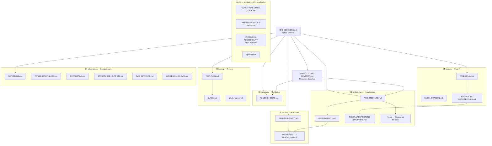

# Indice de Documentacion — CivicAid Voice / Clara

> **Resumen en una linea:** Mapa de navegacion completo de toda la documentacion del proyecto Clara, organizado por audiencia.

## Para quien

- **Jurado del hackathon:** Para evaluar el proyecto de forma rapida y estructurada.
- **Desarrolladores:** Para entender la arquitectura, el codigo y las integraciones.
- **Operadores:** Para desplegar, monitorizar y mantener el sistema en produccion.

---

## Navegacion por Audiencia

### Para el Jurado

| # | Documento | Descripcion |
|---|-----------|-------------|
| 1 | [Resumen Ejecutivo](00-EXECUTIVE-SUMMARY.md) | Vision general del proyecto, impacto, arquitectura y metricas clave |
| 2 | [Guia Rapida para Jueces](06-integrations/JUDGES-QUICK-EVAL.md) | Evaluacion rapida del proyecto |
| 3 | [Runbook de Demo](03-runbooks/RUNBOOK-DEMO.md) | Guion minuto a minuto de la demo con 2 momentos WOW |
| 4 | [Arquitectura Tecnica](02-architecture/ARCHITECTURE.md) | Arquitectura completa con diagramas y decisiones de diseno |
| 5 | [Narrativa para Jueces](08-marketing/NARRATIVA-JUECES-FASE4.md) | Narrativa y propuesta de valor |

### Para Desarrolladores

| # | Documento | Descripcion |
|---|-----------|-------------|
| 6 | [README del Proyecto](../README.md) | Inicio rapido, instalacion, tests, estructura del proyecto |
| 7 | [Arquitectura Tecnica](02-architecture/ARCHITECTURE.md) | Pipeline de 11 skills, dataclasses, feature flags, diagramas |
| 8 | [Observabilidad](02-architecture/OBSERVABILITY.md) | Logs estructurados, tags, decorador @timed, /health |
| 9 | [Propuesta Arquitectura Fase 4](02-architecture/FASE4-ARCHITECTURE-PROPOSAL.md) | Propuesta de evolucion arquitectonica |
| 10 | [Plan de Tests](04-testing/TEST-PLAN.md) | Plan de 10 escenarios de test (T1-T10), 96 tests totales |
| 11 | [Framework de Evals](04-testing/EVALS.md) | Suite de evaluacion automatizada de calidad de respuestas |
| 12 | [Reporte de Evals](04-testing/evals_report.md) | Resultados de la ultima ejecucion de evaluaciones |
| 13 | [Guardrails](06-integrations/GUARDRAILS.md) | Capa de seguridad pre/post para entrada y salida del LLM |
| 14 | [Structured Outputs](06-integrations/STRUCTURED_OUTPUTS.md) | Salidas JSON estructuradas opcionales desde Gemini |
| 15 | [RAG Opcional](06-integrations/RAG_OPTIONAL.md) | Ruta de mejora futura con vector store |

### Para Operaciones

| # | Documento | Descripcion |
|---|-----------|-------------|
| 16 | [Guia de Deploy en Render](05-ops/RENDER-DEPLOY.md) | Paso a paso para desplegar en Render con Docker |
| 17 | [Observability Quickstart](05-ops/OBSERVABILITY-QUICKSTART.md) | Guia rapida de observabilidad para operadores |
| 18 | [Guia de Twilio](06-integrations/TWILIO-SETUP-GUIDE.md) | Configuracion completa de Twilio WhatsApp Sandbox |
| 19 | [Notion OS](06-integrations/NOTION-OS.md) | Sistema operativo en Notion: backlog, KB, testing |

### Fase 4 — Planificacion

| # | Documento | Descripcion |
|---|-----------|-------------|
| 20 | [Fase 4 — Ideacion](01-phases/FASE4-IDEACION.md) | Ideacion y brainstorming para la siguiente iteracion |
| 21 | [Fase 4 — Plan](01-phases/FASE4-PLAN.md) | Plan de ejecucion de Fase 4 |
| 22 | [Fase 4 — Plan Arquitectura](01-phases/FASE4-PLAN-ARQUITECTURA.md) | Propuesta arquitectonica para Fase 4 |

### Marketing, UX y Academico

| # | Documento | Descripcion |
|---|-----------|-------------|
| 23 | [Guia de Tono y Voz de Clara](08-marketing/CLARA-TONE-VOICE-GUIDE.md) | Identidad verbal y tono del asistente |
| 24 | [Analisis UX y Accesibilidad](08-ux/PHASE4-UX-ACCESSIBILITY-ANALYSIS.md) | Analisis de experiencia de usuario |
| 25 | [Filosofia de Diseno](09-academic/design-philosophy.md) | Principios de diseno del proyecto |
| 26 | [Doc Tecnico Sprint 3](09-academic/Sprint3_DocTecnico.md) | Documento tecnico academico |
| 27 | [Presentacion Sprint 3](09-academic/Sprint3_Presentacion.md) | Presentacion academica |

---

## Diagrama de Estructura Documental

---

## Referencias

- [README.md](../README.md) — Punto de entrada del repositorio
- [CLAUDE.md](../CLAUDE.md) — Instrucciones para agentes de desarrollo
- [Resumen Ejecutivo](00-EXECUTIVE-SUMMARY.md) — Vision general del proyecto
