# Indice de Documentacion — CivicAid Voice / Clara

> **Resumen en una linea:** Mapa de navegacion completo de toda la documentacion del proyecto Clara, organizado por audiencia.

## Que es

Este documento es el **indice maestro** de toda la documentacion del proyecto CivicAid Voice / Clara. Permite a cualquier persona — jurado, desarrollador u operador — encontrar rapidamente el documento que necesita.

## Para quien

- **Jurado del hackathon:** Para evaluar el proyecto de forma rapida y estructurada.
- **Desarrolladores:** Para entender la arquitectura, el codigo y las integraciones.
- **Operadores:** Para desplegar, monitorizar y mantener el sistema en produccion.

## Que incluye

- Navegacion por audiencia (3 secciones).
- Diagrama Mermaid de la estructura documental.
- Tabla de estado de cada documento.
- Enlaces directos a los 32 documentos del proyecto (31 unicos, Arquitectura aparece en 2 secciones).

## Que NO incluye

- Contenido tecnico detallado (cada documento enlazado lo contiene).
- Instrucciones de ejecucion (ver [README.md](../README.md) o [RENDER-DEPLOY.md](05-ops/RENDER-DEPLOY.md)).

---

## Navegacion por Audiencia

### Para el Jurado

Documentos esenciales para evaluar el proyecto en 5 minutos:

| # | Documento | Ruta | Descripcion |
|---|-----------|------|-------------|
| 1 | [Resumen Ejecutivo](00-EXECUTIVE-SUMMARY.md) | `docs/00-EXECUTIVE-SUMMARY.md` | Vision general del proyecto, impacto, arquitectura y metricas clave |
| 2 | [Plan Maestro (Fase 0)](01-phases/FASE0-PLAN-MAESTRO-FINAL.md) | `docs/01-phases/FASE0-PLAN-MAESTRO-FINAL.md` | Plan original del proyecto: estrategia, equipo, timeline |
| 3 | [Runbook de Demo](03-runbooks/RUNBOOK-DEMO.md) | `docs/03-runbooks/RUNBOOK-DEMO.md` | Guion minuto a minuto de la demo con 2 momentos WOW |
| 4 | [Estado de Fases](07-evidence/PHASE-STATUS.md) | `docs/07-evidence/PHASE-STATUS.md` | Semaforo de todas las fases y gates del proyecto |
| 5 | [Arquitectura Tecnica](02-architecture/ARCHITECTURE.md) | `docs/02-architecture/ARCHITECTURE.md` | Arquitectura completa con diagramas y decisiones de diseno |

### Para Desarrolladores

Documentos para entender, modificar y extender el codigo:

| # | Documento | Ruta | Descripcion |
|---|-----------|------|-------------|
| 6 | [README del Proyecto](../README.md) | `README.md` | Inicio rapido, instalacion, tests, estructura del proyecto |
| 7 | [Arquitectura Tecnica](02-architecture/ARCHITECTURE.md) | `docs/02-architecture/ARCHITECTURE.md` | Pipeline de 11 skills, dataclasses, feature flags, diagramas |
| 8 | [Observabilidad](02-architecture/OBSERVABILITY.md) | `docs/02-architecture/OBSERVABILITY.md` | Logs estructurados, tags, decorador @timed, /health |
| 9 | [Plan de Tests](04-testing/TEST-PLAN.md) | `docs/04-testing/TEST-PLAN.md` | Plan de 10 escenarios de test (T1-T10), 96 tests totales |
| 10 | [Framework de Evals](04-testing/EVALS.md) | `docs/04-testing/EVALS.md` | Suite de evaluacion automatizada de calidad de respuestas |
| 11 | [Reporte de Evals](04-testing/evals_report.md) | `docs/04-testing/evals_report.md` | Resultados de la ultima ejecucion de evaluaciones |
| 12 | [Guardrails](06-integrations/GUARDRAILS.md) | `docs/06-integrations/GUARDRAILS.md` | Capa de seguridad pre/post para entrada y salida del LLM |
| 13 | [Structured Outputs](06-integrations/STRUCTURED_OUTPUTS.md) | `docs/06-integrations/STRUCTURED_OUTPUTS.md` | Salidas JSON estructuradas opcionales desde Gemini |
| 14 | [RAG Opcional](06-integrations/RAG_OPTIONAL.md) | `docs/06-integrations/RAG_OPTIONAL.md` | Ruta de mejora futura con vector store |
| 15 | [Integracion del Toolkit](02-architecture/TOOLKIT-INTEGRATION.md) | `docs/02-architecture/TOOLKIT-INTEGRATION.md` | 5 modulos del toolkit: observabilidad, structured outputs, guardrails, evals, RAG |
| 16 | [Implementacion MVP (Fase 1)](01-phases/FASE1-IMPLEMENTACION-MVP.md) | `docs/01-phases/FASE1-IMPLEMENTACION-MVP.md` | Tracker de implementacion de la Fase 1 |
| 17 | [Hardening y Deploy (Fase 2)](01-phases/FASE2-HARDENING-DEPLOY-INTEGRATIONS.md) | `docs/01-phases/FASE2-HARDENING-DEPLOY-INTEGRATIONS.md` | Plan de hardening, deploy e integraciones |

### Para Operaciones

Documentos para desplegar, monitorizar y operar Clara en produccion:

| # | Documento | Ruta | Descripcion |
|---|-----------|------|-------------|
| 18 | [Guia de Deploy en Render](05-ops/RENDER-DEPLOY.md) | `docs/05-ops/RENDER-DEPLOY.md` | Paso a paso para desplegar en Render con Docker |
| 19 | [Observability Quickstart](05-ops/OBSERVABILITY-QUICKSTART.md) | `docs/05-ops/OBSERVABILITY-QUICKSTART.md` | Guia rapida de observabilidad para operadores |
| 20 | [Guia de Twilio](06-integrations/TWILIO-SETUP-GUIDE.md) | `docs/06-integrations/TWILIO-SETUP-GUIDE.md` | Configuracion completa de Twilio WhatsApp Sandbox |
| 21 | [Notion OS](06-integrations/NOTION-OS.md) | `docs/06-integrations/NOTION-OS.md` | Sistema operativo en Notion: backlog, KB, testing |
| 22 | [Runbook Fase 2](03-runbooks/RUNBOOK-PHASE2.md) | `docs/03-runbooks/RUNBOOK-PHASE2.md` | Runbook operativo: deploy, verificacion y warm-up |
| 23 | [Referencia MCP](06-integrations/MCP-TOOLS-REFERENCE.md) | `docs/06-integrations/MCP-TOOLS-REFERENCE.md` | Herramientas MCP: notionApi, filesystem, github |
| 24 | [Structured Outputs y Guardrails (Ops)](05-ops/STRUCTURED-OUTPUTS-GUARDRAILS.md) | `docs/05-ops/STRUCTURED-OUTPUTS-GUARDRAILS.md` | Guia operativa combinada de structured outputs y guardrails |
| 25 | [Toolkit Matrix](00-tooling/TOOLKIT-MATRIX.md) | `docs/00-tooling/TOOLKIT-MATRIX.md` | Inventario de herramientas evaluadas e integradas |
| 26 | [Tooling Instalado](00-tooling/installed.md) | `docs/00-tooling/installed.md` | MCPs y skills activos en el entorno de desarrollo |

### Evidencia y Cierre

| # | Documento | Ruta | Descripcion |
|---|-----------|------|-------------|
| 27 | [Evidencia Fase 1](07-evidence/PHASE-1-EVIDENCE.md) | `docs/07-evidence/PHASE-1-EVIDENCE.md` | Registro de evidencia del MVP |
| 28 | [Evidencia Fase 2](07-evidence/PHASE-2-EVIDENCE.md) | `docs/07-evidence/PHASE-2-EVIDENCE.md` | Registro de evidencia de hardening y deploy |
| 29 | [Checklist de Cierre](07-evidence/PHASE-CLOSE-CHECKLIST.md) | `docs/07-evidence/PHASE-CLOSE-CHECKLIST.md` | Checklist de cierre de fases |
| 30 | [Reporte de Cierre Fase 1](07-evidence/phase-1-close-report.md) | `docs/07-evidence/phase-1-close-report.md` | Reporte generado automaticamente al cerrar Fase 1 |
| 31 | [Evidencia Toolkit](07-evidence/TOOLKIT-INTEGRATION-EVIDENCE.md) | `docs/07-evidence/TOOLKIT-INTEGRATION-EVIDENCE.md` | Evidencia de integracion del toolkit |
| 32 | [Plan de Auditoria Fase 2](plans/2026-02-12-phase2-audit.md) | `docs/plans/2026-02-12-phase2-audit.md` | Plan de auditoria basado en evidencia |

---

## Diagrama de Estructura Documental

```mermaid
graph TD
    INDEX["00-DOCS-INDEX.md<br/>Indice Maestro"]
    EXEC["00-EXECUTIVE-SUMMARY.md<br/>Resumen Ejecutivo"]

    subgraph "00-tooling"
        TOOLKIT["TOOLKIT-MATRIX.md"]
        INSTALLED["installed.md"]
    end

    subgraph "01-phases — Fases del Proyecto"
        F0["FASE0 — Plan Maestro"]
        F1["FASE1 — MVP"]
        F2["FASE2 — Hardening"]
    end

    subgraph "02-architecture — Arquitectura"
        ARCH["ARCHITECTURE.md"]
        OBS["OBSERVABILITY.md"]
        TKIT["TOOLKIT-INTEGRATION.md"]
        DIAG["*.mmd — Diagramas Mermaid"]
    end

    subgraph "03-runbooks — Runbooks"
        RB_DEMO["RUNBOOK-DEMO.md"]
        RB_P2["RUNBOOK-PHASE2.md"]
    end

    subgraph "04-testing — Testing"
        TESTPLAN["TEST-PLAN.md"]
        EVALS["EVALS.md"]
        EVALREPORT["evals_report.md"]
    end

    subgraph "05-ops — Operaciones"
        RENDER["RENDER-DEPLOY.md"]
        OBSQS["OBSERVABILITY-QUICKSTART.md"]
        SOGUARD["STRUCTURED-OUTPUTS-GUARDRAILS.md"]
    end

    subgraph "06-integrations — Integraciones"
        NOTION["NOTION-OS.md"]
        TWILIO["TWILIO-SETUP-GUIDE.md"]
        GUARD["GUARDRAILS.md"]
        STRUCT["STRUCTURED_OUTPUTS.md"]
        RAG["RAG_OPTIONAL.md"]
        MCPREF["MCP-TOOLS-REFERENCE.md"]
    end

    subgraph "07-evidence — Evidencia"
        STATUS["PHASE-STATUS.md"]
        EV1["PHASE-1-EVIDENCE.md"]
        EV2["PHASE-2-EVIDENCE.md"]
        CLOSE["PHASE-CLOSE-CHECKLIST.md"]
        REPORT["phase-1-close-report.md"]
        TKEV["TOOLKIT-INTEGRATION-EVIDENCE.md"]
    end

    INDEX --> EXEC
    INDEX --> F0
    INDEX --> F1
    INDEX --> F2
    INDEX --> ARCH
    INDEX --> OBS
    INDEX --> RB_DEMO
    INDEX --> TESTPLAN
    INDEX --> RENDER
    INDEX --> NOTION
    INDEX --> STATUS

    EXEC --> ARCH
    EXEC --> RB_DEMO
    F1 --> EV1
    F2 --> EV2
    ARCH --> OBS
    ARCH --> TKIT
    ARCH --> DIAG
    TESTPLAN --> EVALS
    RENDER --> OBSQS
    OBS --> OBSQS
    GUARD --> SOGUARD
    STRUCT --> SOGUARD
```

---

## Estado de los Documentos

| Documento | Carpeta | Estado |
|-----------|---------|--------|
| Indice de Documentacion | `docs/` | Completo |
| Resumen Ejecutivo | `docs/` | Completo |
| Plan Maestro (Fase 0) | `01-phases/` | Completo |
| Implementacion MVP (Fase 1) | `01-phases/` | Completo |
| Hardening y Deploy (Fase 2) | `01-phases/` | Completo |
| Arquitectura Tecnica | `02-architecture/` | Completo |
| Observabilidad | `02-architecture/` | Completo |
| Integracion del Toolkit | `02-architecture/` | Completo |
| Diagramas Mermaid (4 archivos) | `02-architecture/` | Completo |
| Runbook Demo | `03-runbooks/` | Completo |
| Runbook Fase 2 | `03-runbooks/` | Completo |
| Plan de Tests | `04-testing/` | Completo |
| Framework de Evals | `04-testing/` | Completo |
| Reporte de Evals | `04-testing/` | Completo |
| Deploy en Render | `05-ops/` | Completo |
| Observability Quickstart | `05-ops/` | Completo |
| Structured Outputs y Guardrails (Ops) | `05-ops/` | Completo |
| Notion OS | `06-integrations/` | Completo |
| Guia de Twilio | `06-integrations/` | Completo |
| Guardrails | `06-integrations/` | Completo |
| Structured Outputs | `06-integrations/` | Completo |
| RAG Opcional | `06-integrations/` | Completo |
| Referencia MCP | `06-integrations/` | Completo |
| Toolkit Matrix | `00-tooling/` | Completo |
| Tooling Instalado | `00-tooling/` | Completo |
| Estado de Fases | `07-evidence/` | Completo |
| Evidencia Fase 1 | `07-evidence/` | Completo |
| Evidencia Fase 2 | `07-evidence/` | Completo |
| Checklist de Cierre | `07-evidence/` | Completo |
| Reporte Cierre Fase 1 | `07-evidence/` | Completo |
| Evidencia Toolkit | `07-evidence/` | Completo |
| Plan Auditoria Fase 2 | `plans/` | Completo |

---

## Como se verifica

1. Comprobar que todos los enlaces de este indice apuntan a archivos existentes.
2. Ejecutar `ls docs/**/*.md` y verificar que cada archivo aparece en este indice.
3. Abrir 3-5 enlaces al azar y confirmar que el titulo y la descripcion coinciden.

## Referencias

- [README.md](../README.md) — Punto de entrada del repositorio
- [CLAUDE.md](../CLAUDE.md) — Instrucciones para agentes de desarrollo
- [Resumen Ejecutivo](00-EXECUTIVE-SUMMARY.md) — Vision general del proyecto
