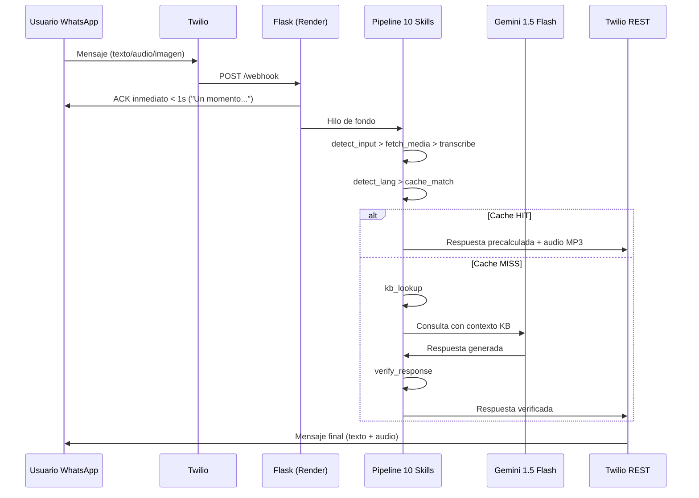

# CivicAid Voice / Clara — Resumen Ejecutivo

> **Resumen en una linea:** Clara es un asistente conversacional de WhatsApp que ayuda a personas vulnerables en Espana a navegar tramites de servicios sociales, respondiendo en su idioma con texto y audio.

## Que es

Clara es un **chatbot de WhatsApp** disenado para poblaciones vulnerables en Espana — inmigrantes, personas mayores y personas en riesgo de exclusion social — que necesitan orientacion sobre tramites administrativos esenciales. Clara habla el idioma del usuario, entiende notas de voz, y traduce la burocracia a lenguaje humano.

**Hackathon:** OdiseIA4Good — UDIT | **Fecha:** Febrero 2026

## Para quien

- **Jurado del hackathon:** Este documento ofrece una vision completa del proyecto en 5 minutos.
- **Colaboradores potenciales:** Para entender el alcance, la arquitectura y el estado actual.
- **Equipo interno:** Como referencia rapida del proyecto.

## Que incluye

- Problema que resuelve y diferenciadores clave.
- Arquitectura tecnica con diagrama.
- Stack tecnologico completo.
- Estado de las 3 fases del proyecto.
- Metricas clave y equipo.

## Que NO incluye

- Instrucciones de instalacion (ver [README.md](../README.md)).
- Detalle tecnico de la arquitectura (ver [ARCHITECTURE.md](02-architecture/ARCHITECTURE.md)).
- Guion de la demo (ver [RUNBOOK-DEMO.md](03-runbooks/RUNBOOK-DEMO.md)).

---

## El Problema

En Espana, **3,2 millones de inmigrantes** y **9,5 millones de personas mayores** enfrentan barreras burocraticas para acceder a servicios sociales basicos. El **40% de los inmigrantes** no completa los tramites necesarios por barreras de idioma. Los procesos administrativos estan escritos en lenguaje tecnico, en un solo idioma, y repartidos en multiples webs oficiales dificiles de navegar.

Clara reduce esa barrera a **cero**: responde en el idioma del usuario, por el canal que ya usa (WhatsApp), con informacion verificada de fuentes oficiales.

## Diferenciadores Clave

| # | Diferenciador | Descripcion |
|---|---------------|-------------|
| 1 | **WhatsApp nativo** | Cero descargas. Funciona donde los usuarios ya estan (95% de penetracion en Espana) |
| 2 | **Voz primero** | Audio de entrada y audio de salida. Critico para poblaciones con baja alfabetizacion digital |
| 3 | **Multilingue** | Deteccion automatica de idioma. Espanol y frances (2 idiomas soportados) |
| 4 | **Informacion verificada** | Respuestas basadas en datos oficiales del gobierno, no alucinaciones |

## Tramites Cubiertos

| Tramite | Descripcion |
|---------|-------------|
| **Ingreso Minimo Vital (IMV)** | Prestacion economica de la Seguridad Social para personas en situacion de vulnerabilidad |
| **Empadronamiento** | Inscripcion en el padron municipal, requisito previo para servicios publicos |
| **Tarjeta Sanitaria** | Documento que acredita el derecho a la asistencia sanitaria publica |

## Arquitectura Tecnica



**Patron TwiML ACK:** El servidor responde a Twilio con un HTTP 200 inmediato (en menos de 1 segundo) con un mensaje de acknowledgement. El procesamiento real ocurre en un hilo de fondo, y la respuesta final se envia mediante la API REST de Twilio.

## Stack Tecnologico

| Componente | Tecnologia | Justificacion |
|------------|-----------|---------------|
| Lenguaje | Python 3.11 | Ecosistema ML maduro, tipado con dataclasses |
| Framework web | Flask | Ligero, suficiente para un webhook unico |
| Canal | Twilio WhatsApp Sandbox | Integracion rapida para hackathon |
| Transcripcion | Gemini (primario) / Whisper base (local) | Multilingue, bajo consumo de RAM |
| LLM | Gemini 1.5 Flash | Rapido, economico, ventana de contexto amplia |
| Text-to-Speech | gTTS (Google TTS) | Gratuito, multiples idiomas |
| Deteccion de idioma | langdetect | Libreria ligera, soporta idiomas objetivo |
| Base de conocimiento | JSON estatico (3 ficheros) | Sin dependencias externas, versionable en Git |
| Despliegue | Render (free tier) + Docker | CI/CD automatico desde GitHub, SSL incluido |
| Observabilidad | Logs estructurados + /health | request_id por peticion, tags por etapa |

## Estado del Proyecto

### Fase 0 — Plan Maestro: CERRADA

Plan original del proyecto definido: arquitectura, runbook de demo, estrategia cache-first, asignacion de equipo. Todos los artefactos de planificacion entregados.

### Fase 1 — MVP: CERRADA

- 93 tests pasando (88 passed + 5 xpassed: unit, integration, e2e)
- Pipeline de 10 skills completamente implementado
- Cache-first con 8 respuestas precalculadas + 6 archivos MP3 de audio
- Patron TwiML ACK operativo (acknowledgement en menos de 1 segundo)
- 10 feature flags configurables
- Guardrails de seguridad pre/post activados

### Fase 2 — Hardening, Deploy e Integraciones: CERRADA

| Gate | Descripcion | Estado |
|------|-------------|--------|
| P2.1 | Verificacion pipeline Twilio + guia de setup | PASS |
| P2.2 | Deploy en Render reproducible + /health verificado | PASS |
| P2.3 | Cron warm-up documentado y verificado (cada 14 min) | PASS |
| P2.4 | Notion actualizado (75 entradas: 37+12+26) | PASS |
| P2.5 | Script de verificacion QA + captura de evidencia | PASS |
| P2.6 | Escaneo de seguridad + auditoria de secretos | PASS |
| P2.OBS | Observabilidad + logs estructurados | PASS |

**Lo que anade la Fase 2:**
- Modulo de observabilidad (`src/utils/observability.py`) con request_id y timings por etapa
- Guardrails de entrada/salida (`src/core/guardrails.py`) con validacion configurable
- Transcripcion de audio con Gemini como alternativa a Whisper local (menor consumo de RAM)
- Respuestas de audio con gTTS para escenarios de cache miss
- Feature flags del toolkit: `OBSERVABILITY_ON`, `GUARDRAILS_ON`, `STRUCTURED_OUTPUT_ON`, `RAG_ENABLED`
- Documentacion completa de deploy/ops con cron warm-up y health checks

## Metricas Clave

| Metrica | Valor |
|---------|-------|
| Tests totales | 93 (88 passed + 5 xpassed) |
| Skills en pipeline | 10 |
| Feature flags | 10 |
| Entradas en cache | 8 |
| Entradas en Notion | 75 (37+12+26) |
| Tramites cubiertos | 3 |
| Idiomas soportados | 2 (ES, FR) |
| Componentes en /health | 8 |
| Intervalo cron keep-alive | 14 min |
| Puerto Render | 10000 |
| Puerto local | 5000 |

## Flujo de Demo (3 minutos)

| Tiempo | Que ocurre | Ruta tecnica |
|--------|-----------|--------------|
| 0:00 | Introduccion — el problema de la exclusion burocratica | — |
| 0:30 | **WOW 1:** Maria pregunta "Que es el IMV?" por texto en WhatsApp — respuesta instantanea con texto + audio | Cache hit, menos de 2 segundos |
| 1:15 | Transicion — presentando a Ahmed, inmigrante francofono | — |
| 1:30 | **WOW 2:** Ahmed envia nota de voz en frances preguntando por el empadronamiento — respuesta en frances con audio | Transcripcion > detect lang > KB > Gemini > ~10s |
| 2:30 | Cierre — escalabilidad, coste cero, impacto real | — |

Guion completo con procedimientos de fallback: [RUNBOOK-DEMO.md](03-runbooks/RUNBOOK-DEMO.md)

## Equipo

| Persona | Rol |
|---------|-----|
| Robert | Backend lead, pipeline, presentador de demo |
| Marcos | Routes, Twilio, deploy, pipeline de audio |
| Lucas | Investigacion KB, testing, assets de demo |
| Daniel | Web Gradio (backup), video |
| Andrea | Notion, slides, coordinacion |

## Mapa de Documentacion

| Documento | Ruta |
|-----------|------|
| **Indice de Documentacion** | [docs/00-DOCS-INDEX.md](00-DOCS-INDEX.md) |
| **Plan Maestro (Fase 0)** | [docs/01-phases/FASE0-PLAN-MAESTRO-FINAL.md](01-phases/FASE0-PLAN-MAESTRO-FINAL.md) |
| **Implementacion MVP (Fase 1)** | [docs/01-phases/FASE1-IMPLEMENTACION-MVP.md](01-phases/FASE1-IMPLEMENTACION-MVP.md) |
| **Hardening y Deploy (Fase 2)** | [docs/01-phases/FASE2-HARDENING-DEPLOY-INTEGRATIONS.md](01-phases/FASE2-HARDENING-DEPLOY-INTEGRATIONS.md) |
| **Arquitectura Tecnica** | [docs/02-architecture/ARCHITECTURE.md](02-architecture/ARCHITECTURE.md) |
| **Observabilidad** | [docs/02-architecture/OBSERVABILITY.md](02-architecture/OBSERVABILITY.md) |
| **Runbook Demo** | [docs/03-runbooks/RUNBOOK-DEMO.md](03-runbooks/RUNBOOK-DEMO.md) |
| **Plan de Tests** | [docs/04-testing/TEST-PLAN.md](04-testing/TEST-PLAN.md) |
| **Deploy en Render** | [docs/05-ops/RENDER-DEPLOY.md](05-ops/RENDER-DEPLOY.md) |
| **Notion OS** | [docs/06-integrations/NOTION-OS.md](06-integrations/NOTION-OS.md) |
| **Estado de Fases** | [docs/07-evidence/PHASE-STATUS.md](07-evidence/PHASE-STATUS.md) |

---

## Como se verifica

```bash
# Ejecutar todos los tests
pytest tests/ -q

# Verificar health endpoint local
curl http://localhost:5000/health | python3 -m json.tool

# Verificar health endpoint en Render
curl https://civicaid-voice.onrender.com/health | python3 -m json.tool

# Lint del codigo
ruff check src/ tests/ --select E,F,W --ignore E501
```

## Referencias

- [Indice de Documentacion](00-DOCS-INDEX.md)
- [Arquitectura Tecnica](02-architecture/ARCHITECTURE.md)
- [Runbook de Demo](03-runbooks/RUNBOOK-DEMO.md)
- [README.md](../README.md)
