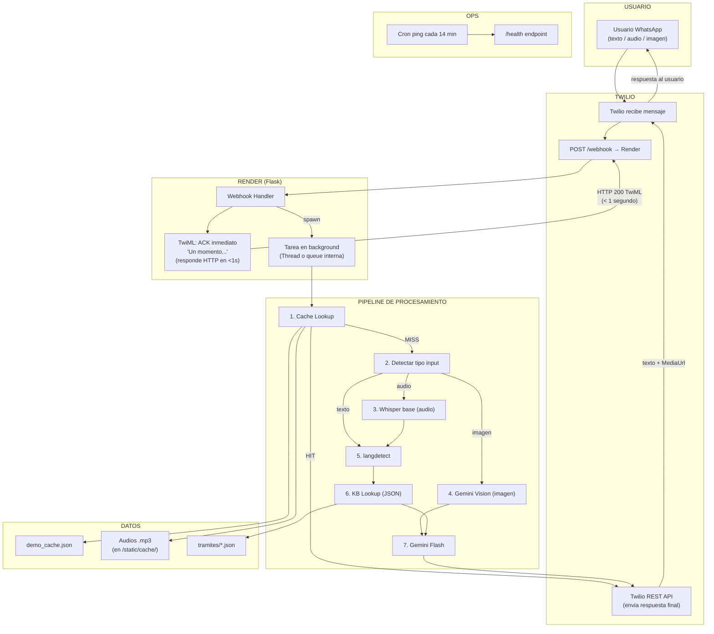

# FASE 0 — Plan Maestro Final (WhatsApp-First)

> **Proyecto:** CivicAid Voice / Clara
> **Hackathon:** OdiseIA4Good — UDIT
> **Fecha:** 11 Feb 2026
> **Estado:** FINAL. Este documento cierra Fase 0. No hay versiones anteriores.

---

# 1) VEREDICTO EJECUTIVO

## Que se construye

Clara es un asistente conversacional por WhatsApp que ayuda a poblaciones vulnerables en Espana (inmigrantes, mayores, personas en exclusion) a navegar tramites sociales. Habla el idioma del usuario, entiende notas de voz, explica documentos oficiales, y traduce la burocracia a lenguaje humano.

## Por que gana este hackathon

| Criterio del jurado | Peso | Como atacamos |
|---|---|---|
| Innovacion | 30% | WhatsApp 100% por audio (nadie mas lo hara), Vision IA para documentos, multilingue automatico |
| Impacto Social | 30% | 3.2M inmigrantes + 9.5M mayores en Espana. Canal que ya usan (WhatsApp). Cero barreras de entrada |
| Viabilidad | 20% | Demo en vivo por WhatsApp. Stack 0 EUR. El jurado lo ve funcionar en tiempo real |
| Presentacion | 20% | 2 momentos WOW en vivo: audio en frances + foto de documento. Narrativa emocional |

## Que queda fuera

- Soporte de arabe (FR ya demuestra multilingue)
- Interaccion del jurado por WhatsApp en vivo (friccion de registro)
- Mas de 3 tramites (IMV, empadronamiento, tarjeta sanitaria)
- Base de datos relacional, login, memoria entre sesiones
- n8n, Ollama, apps nativas
- Web como canal principal (solo es backup)

## Criterio de exito de Fase 0

**Test:** Desde el movil de Robert, mandar un audio en frances por WhatsApp preguntando por el empadronamiento. Recibir de vuelta: (1) un ACK inmediato, (2) una respuesta en frances con pasos y analogia cultural, (3) una nota de voz en frances. Todo en menos de 20 segundos.

Si esto funciona, Fase 0 esta cerrada.

---

# 2) ARQUITECTURA FINAL

## Diagrama de Alto Nivel



## Patron de Mensajeria: TwiML ACK + Twilio REST API

Este es el patron central del sistema. Resuelve el timeout de ~15s de Twilio:

```
PASO 1 — ACK INMEDIATO (< 1 segundo):
  Twilio manda POST /webhook.
  Flask responde HTTP 200 con TwiML:
    <Response>
      <Message>Un momento, estoy procesando tu mensaje...</Message>
    </Response>
  Twilio entrega el ACK al usuario inmediatamente.
  El usuario VE que Clara "respondio". No hay silencio.

PASO 2 — PROCESAMIENTO (en background):
  Flask lanza el pipeline en un thread.
  Puede tardar 5s (cache hit) o 20s (audio + LLM).
  El timeout de Twilio ya no importa porque el HTTP ya respondio.

PASO 3 — RESPUESTA FINAL (via Twilio REST API):
  Cuando el pipeline termina, envia la respuesta real:
    from twilio.rest import Client
    client = Client(ACCOUNT_SID, AUTH_TOKEN)
    client.messages.create(
        body=respuesta_texto,
        from_='whatsapp:+14155238886',  # numero sandbox
        to='whatsapp:+34XXXXXXXXX',     # usuario
        media_url=[url_audio_mp3]       # solo si hay audio
    )
  El usuario recibe 2 mensajes: el ACK + la respuesta real.
```

**Por que un thread y no otro mecanismo:**
En un hackathon sobre Render free tier, un `threading.Thread(target=procesar, daemon=True)` es suficiente. No necesitamos Celery, Redis ni colas externas. El thread vive dentro del mismo proceso Flask. Si Render mata el proceso (unlikely durante una request activa), el cron lo revive en 14 minutos. Para 3 demos, esto es fiable.

**Riesgo mitigado:** Si el thread falla por cualquier razon, el usuario ya tiene el ACK ("Un momento..."). En el peor caso, no llega la segunda respuesta. Robert lo resuelve en la demo diciendo "Les leo la respuesta mientras carga" y mostrando un screenshot.

## Flujo: WhatsApp Texto

```
Usuario manda texto
→ Twilio POST /webhook (Body="Que es el IMV?", From="+34...")
→ Flask:
    1. Responde TwiML ACK (<1s)
    2. Thread: cache_match("Que es el IMV?", idioma=langdetect("es"))
       → HIT? Enviar cache via REST API (total: ~2s)
       → MISS? langdetect → KB lookup → Gemini (timeout 6s) → REST API (total: ~8s)
       → TIMEOUT? Enviar respuesta generica via REST API (total: ~7s)
```

## Flujo: WhatsApp Audio (Caso Ahmed)

```
Usuario manda nota de voz
→ Twilio POST /webhook (MediaUrl0="https://api.twilio.com/...", MediaContentType0="audio/ogg")
→ Flask:
    1. Responde TwiML ACK (<1s): "Estoy escuchando tu audio..."
    2. Thread:
       a. Descargar .ogg de Twilio (1-2s)
       b. Convertir con pydub/ffmpeg (500ms)
       c. Whisper base transcribir (8-12s)
       d. cache_match(transcripcion, idioma)
          → HIT? Enviar cache + audio pre-hosted via REST API (total: ~13s)
          → MISS? Gemini (6s) + gTTS (2s) → REST API (total: ~22s)
          → TIMEOUT Whisper (>12s)? "No pude entender tu audio. Escribe tu pregunta"
```

## Flujo: WhatsApp Imagen (Caso Maria por WA, si aplica)

```
Usuario manda foto
→ Flask:
    1. ACK: "Estoy analizando tu documento..."
    2. Thread:
       a. SI DEMO_MODE: retornar respuesta cacheada para imagen (siempre la misma carta)
       b. SI NO: descargar imagen → Gemini Vision (timeout 8s) → REST API
```

**Nota:** En la demo, Maria se muestra por web (backup). Si hay tiempo de sobra, se puede mostrar por WA tambien, pero no es el WOW principal.

## Donde Vive el Cache

```
Repositorio:
  data/cache/demo_cache.json    ← entradas con patrones y respuestas
  data/cache/ahmed_fr.mp3       ← audio pre-generado
  data/cache/imv_es.mp3
  data/cache/empadronamiento_es.mp3
  data/cache/tarjeta_es.mp3
  data/cache/fatima_fr.mp3
  data/cache/maria_es.mp3

Deploy en Render:
  Los archivos .mp3 se sirven via Flask como estaticos:
  GET https://[render-url]/static/cache/ahmed_fr.mp3

  Esta URL es la que se pasa a Twilio como MediaUrl.
  Funciona porque Render esta despierto (acaba de procesar el request).
  El cron de 14 min mantiene Render vivo entre requests.

  Backup: los mismos .mp3 estan en el repo de HuggingFace Space.
  Si Render muere, se puede cambiar la base URL a HuggingFace.
```

## Feature Flags

Archivo `src/core/config.py`, valores leidos de variables de entorno:

| Flag | Default | Demo | Que hace |
|---|---|---|---|
| `DEMO_MODE` | `false` | `true` | Cache-first. Imagenes siempre retornan respuesta cacheada. TTS live OFF (solo audios pre-hosted) |
| `LLM_LIVE` | `true` | `true` | Si `false`, NUNCA llama a Gemini. Solo cache. Activar si Gemini cae |
| `WHISPER_ON` | `true` | `true` | Si `false`, audio retorna "Escribe tu pregunta". Activar si Whisper falla |
| `LLM_TIMEOUT` | `8` | `6` | Segundos max de espera a Gemini |
| `WHISPER_TIMEOUT` | `15` | `12` | Segundos max de espera a Whisper |
| `AUDIO_BASE_URL` | `""` | `"https://[render-url]/static/cache"` | Base URL para los .mp3 pre-hosted |

**Como cambiar en vivo:** Render Dashboard → Environment → cambiar valor → Save. Render redeploya en ~30s. O si hay endpoint admin: `POST /admin/flag?key=LLM_LIVE&value=false&token=SECRET`.

---

# 3) PLAN DE OPS ANTI-DEMO-KILL

## Health Endpoint

```
GET /health
Respuesta (JSON):
{
  "status": "ok",
  "uptime_s": 4321,
  "demo_mode": true,
  "cache_entries": 8,
  "whisper_loaded": true,
  "ffmpeg": true,
  "gemini_key_set": true
}

Implementacion: una ruta Flask de 10 lineas. Sin logica compleja.
Si whisper_loaded es false: el modelo no se cargo (cold start incompleto).
Si ffmpeg es false: no se encontro ffmpeg en el sistema.
```

## Warm-Up Automatico

| Mecanismo | Config | Frecuencia | Que pinga |
|---|---|---|---|
| **cron-job.org** (gratis) | URL: `https://[render-url]/health` | Cada 14 minutos | Render despierto |
| **cron-job.org** (gratis) | URL: `https://[hf-space-url]/` | Cada 10 minutos | HuggingFace despierto |

**Por que 14 minutos:** Render free tier duerme tras ~15 min de inactividad. Un ping cada 14 min garantiza que nunca duerme. Margen de seguridad de 1 minuto.

**Configurar en cron-job.org:**
1. Crear cuenta gratuita
2. New cron job → URL → Schedule: every 14 minutes → Save
3. Verificar que ejecuta (panel muestra ultimos pings)

## Warm-Up Manual Pre-Demo (T-15 minutos)

| Min | Accion | Quien | Check |
|---|---|---|---|
| T-15 | Abrir HuggingFace Space en navegador | Daniel | Sin spinner, pagina carga |
| T-14 | Mandar "Hola" por WA al sandbox | Robert | Recibe ACK + respuesta en <15s |
| T-12 | Mandar nota de voz de 5s ("Hola, que es el IMV?") | Robert | Recibe ACK + respuesta con audio en <25s |
| T-10 | Verificar /health de Render | Robert (navegador) | JSON con todos los campos en `true/ok` |
| T-8 | Probar mirroring movil → proyector (cable) | Andrea | WA visible en pantalla grande |
| T-6 | Verificar audio demo de Ahmed en galeria del movil | Robert | Audio .ogg listo para reenviar |
| T-4 | Verificar carta de Maria en laptop | Daniel | Imagen lista para subir a web |
| T-2 | Abrir slides en pantalla completa | Andrea | Slide 1 visible |

## Logs Criticos en Vivo

En Render Dashboard → Logs, buscar:

| Patron | Significado | Accion si falta |
|---|---|---|
| `[ACK] Sent to +34...` | ACK entregado al usuario | Si no aparece: webhook no recibio el mensaje |
| `[CACHE] HIT ahmed_empadronamiento_fr` | Demo respondida desde cache | Excelente. Rapido |
| `[CACHE] MISS` | Input no matcheo cache, va a LLM | Normal fuera de demo |
| `[WHISPER] Done in XXXXms` | Transcripcion completada | Si >12000ms: considerar desactivar |
| `[LLM] Done in XXXXms` | Gemini respondio | Si >6000ms: investigar |
| `[LLM] TIMEOUT` | Gemini no respondio a tiempo | Cache o generica enviada |
| `[WHISPER] TIMEOUT` | Audio no se pudo transcribir | "Escribe tu pregunta" enviado |
| `[REST] Sent final to +34...` | Respuesta real enviada al usuario | Si no aparece: thread fallo |
| `[ERROR]` | Cualquier error | Investigar de inmediato |

## Degradacion por Niveles

```
NIVEL 0 — TODO FUNCIONA
  WA Audio → ACK(1s) → Whisper(10s) → Cache/LLM(3s) → REST con texto + audio
  Experiencia: usuario recibe "Un momento" + respuesta completa con voz
  Latencia total: ~14s

NIVEL 1 — WHISPER LENTO (>12s)
  Gatillo: Whisper timeout
  Accion: Enviar "No pude entender tu audio. Puedes escribirme tu pregunta?"
  El usuario reintenta por texto → cache hit en <2s

NIVEL 2 — LLM LENTO (>6s)
  Gatillo: Gemini timeout
  Accion: Servir respuesta de cache si pattern matchea. Sino: respuesta generica.
  "Te recomiendo consultar en [url_oficial] o llamar al [tel]"

NIVEL 3 — LLM CAIDO (errores 5xx repetidos)
  Gatillo: 2 errores consecutivos de Gemini
  Accion: Robert activa LLM_LIVE=false en Render (30s redeploy). Todo sale de cache.

NIVEL 4 — RENDER CAIDO (no responde /health)
  Gatillo: WA no da ACK tras 15s
  Accion durante demo: Robert dice "Les muestro en la web" → demo en HuggingFace
  Accion tecnica: Marcos revisa Render logs. Si murio, redeploy manual (2-3 min)

NIVEL 5 — INTERNET MUERTO
  Gatillo: ni WA ni web responden
  Accion: Daniel reproduce video backup (90s). Robert narra por encima.

REGLA DE ORO:
  Si ante el jurado pasan 15 segundos sin respuesta visible de WhatsApp
  (despues del ACK), Robert pasa a mostrar la web o el video.
  NUNCA mas de 15 segundos de silencio.
```

---

# 4) CACHE-FIRST DEMO

## Entradas Obligatorias

| # | ID | Patron(es) | Idioma | Canal | Texto respuesta | Audio |
|---|---|---|---|---|---|---|
| 1 | `ahmed_empadronamiento_fr` | `inscrire`, `mairie`, `empadron`, `enregistr` | fr | WA texto/audio | Empadronamiento en frances con analogia wilaya | `ahmed_fr.mp3` |
| 2 | `fatima_salud_fr` | `malade`, `sante`, `hopital`, `carte.*sante`, `medecin` | fr | WA texto | Urgencias + tarjeta sanitaria en frances | `fatima_fr.mp3` |
| 3 | `imv_es` | `ingreso.minimo`, `IMV`, `ayuda.*dinero`, `prestacion` | es | WA/Web | Explicacion IMV en espanol | `imv_es.mp3` |
| 4 | `empadronamiento_es` | `empadron`, `padron`, `registr.*ayuntamiento` | es | WA/Web | Empadronamiento en espanol | `empadronamiento_es.mp3` |
| 5 | `tarjeta_sanitaria_es` | `tarjeta.*sanit`, `medico.*sin.*papel`, `salud`, `hospital` | es | WA/Web | Tarjeta sanitaria en espanol | `tarjeta_es.mp3` |
| 6 | `maria_carta_vision` | `__IMAGE__` (cualquier imagen en DEMO_MODE) | es | WA/Web | Explicacion carta SS + sugerencia proactiva | `maria_es.mp3` |
| 7 | `saludo_es` | `^hola`, `^buenos`, `^buenas` | es | WA/Web | Saludo de Clara + lista de tramites | - |
| 8 | `saludo_fr` | `^bonjour`, `^salut` | fr | WA | Saludo en frances + lista de tramites | - |

## Esquema demo_cache.json

```json
{
  "entries": [
    {
      "id": "ahmed_empadronamiento_fr",
      "patterns": ["inscrire", "mairie", "empadron", "enregistr"],
      "match_mode": "any_keyword",
      "idioma": "fr",
      "respuesta": "Bonjour ! Pour vous inscrire a la mairie de Madrid (c'est ce qu'on appelle 'empadronamiento', un peu comme le registre de la wilaya au Maroc), voici ce qu'il faut faire :\n\n1. Prenez rendez-vous a l'Oficina de Atencion al Ciudadano\n2. Apportez votre passeport et un justificatif de domicile (contrat de location ou facture)\n3. C'est entierement gratuit\n4. Le certificat vous sera remis sur place\n\nVous pouvez prendre rendez-vous sur madrid.es ou en appelant le 010.\n\nPour plus d'informations : madrid.es/empadronamiento",
      "audio_file": "ahmed_fr.mp3"
    },
    {
      "id": "maria_carta_vision",
      "patterns": ["__IMAGE__"],
      "match_mode": "image_demo",
      "idioma": "es",
      "respuesta": "He analizado tu documento. Es una comunicacion de la Seguridad Social sobre tu pension.\n\nEn resumen:\n- Te informan del importe actualizado de tu pension para este periodo\n- No tienes que hacer nada urgente, es informativo\n- Conserva este documento para tus registros\n\nAdemas, segun tu perfil, podrias tener derecho al complemento de pension a minimos. Si quieres, te explico como solicitarlo.\n\nPara informacion oficial: seg-social.es o llama al 900 16 65 65",
      "audio_file": "maria_es.mp3"
    }
  ]
}
```

(Las 8 entradas siguen el mismo formato. Solo muestro 2 por brevedad.)

## Logica de Matching

```
FUNCION cache_match(texto, idioma, tipo_input):

    # Imagenes en demo: siempre cache
    SI tipo_input == "imagen" Y DEMO_MODE == true:
        RETORNAR entrada con match_mode == "image_demo"

    texto_lower = texto.lower().strip()

    mejor_match = None
    mejor_score = 0

    PARA cada entrada EN cache.entries:
        SI entrada.match_mode == "image_demo":
            CONTINUAR  # solo matchea imagenes

        # Filtro idioma (si la entrada lo requiere)
        SI entrada.idioma != idioma Y entrada.idioma != "any":
            CONTINUAR

        # Contar keywords que aparecen en el texto
        hits = 0
        PARA patron EN entrada.patterns:
            SI patron empieza con "^":
                SI texto_lower empieza con patron[1:]:
                    hits += 1
            SINO:
                SI patron EN texto_lower:
                    hits += 1

        score = hits / len(entrada.patterns)
        SI hits >= 1 Y score > mejor_score:
            mejor_score = score
            mejor_match = entrada

    RETORNAR mejor_match  # o None si no hay match
```

**Por que keywords simples y no regex/NLP:** Los inputs de la demo son controlados (nosotros elegimos que mandar). Un match por keywords con 1+ hits es suficiente y no puede fallar de forma impredecible. No necesitamos embeddings ni fuzzy matching para 8 entradas.

## Hosting de Audios

**Estrategia: servir desde Render como archivos estaticos.**

```python
# En Flask:
from flask import send_from_directory
import os

CACHE_DIR = os.path.join(os.path.dirname(__file__), '..', '..', 'data', 'cache')

@app.route('/static/cache/<filename>')
def serve_cache_audio(filename):
    return send_from_directory(CACHE_DIR, filename, mimetype='audio/mpeg')
```

URL resultante: `https://[render-app].onrender.com/static/cache/ahmed_fr.mp3`

Twilio la usa como MediaUrl:
```python
client.messages.create(
    body=respuesta_texto,
    from_='whatsapp:+14155238886',
    to=user_number,
    media_url=['https://[render-app].onrender.com/static/cache/ahmed_fr.mp3']
)
```

**Esto funciona porque:** Render esta despierto en ese momento (acaba de procesar el webhook). Twilio fetchea la URL inmediatamente. No hay cold start.

**Backup:** Los mismos .mp3 estan en el repo de GitHub y en HuggingFace Space. Si Render muere, cambiar `AUDIO_BASE_URL` a la URL de HuggingFace.

## Regla TTS en DEMO_MODE

```
SI DEMO_MODE == true:
    NO generar audio con gTTS en vivo.
    SOLO usar audios pre-hosted (.mp3 del cache).
    Razon: gTTS anade 2-3s de latencia y puede sonar robotico.
    Los audios pre-generados estan pulidos y son instantaneos.

SI DEMO_MODE == false (desarrollo):
    Generar audio con gTTS en vivo si no hay cache hit.
    Aceptar latencia extra porque no hay jurado mirando.
```

---

# 5) RUNBOOK DE DEMO (3 min, 2 WOWs)

## Minuto a Minuto

| Tiempo | Robert dice | Pantalla | Accion tecnica | Nota |
|---|---|---|---|---|
| **0:00** | "En Espana, millones de personas no pueden acceder a ayudas sociales por barreras de idioma y tecnologia." | **Slide 1:** titulo + "4.5M personas" | - | Captar atencion |
| **0:12** | "Les presento a Clara. Habla tu idioma, entiende tu voz, lee documentos, y traduce la burocracia a lenguaje humano." | **Slide 2:** 4 iconos diferenciadores | - | Rapido |
| **0:24** | "Ahmed llego de Marruecos. Habla frances. Necesita empadronarse. No entiende la web del ayuntamiento." | **Slide 3:** persona Ahmed | - | Empatia |
| **0:34** | "Ahmed le manda un audio a Clara por WhatsApp." | **WhatsApp en proyector** | Robert REENVIA el audio pre-grabado de Ahmed al chat del sandbox | NO improvisar, NO grabar en vivo |
| **0:37** | *(pausa 1s)* "Clara recibe el audio..." | WA: audio enviado, palomitas | ACK llega: "Estoy escuchando tu audio..." | El ACK cubre el silencio |
| **0:40** | "...detecta que Ahmed habla frances, transcribe su mensaje..." | WA: ACK visible | Pipeline procesando en background | **FRASE PUENTE clave** |
| **0:46** | "...busca la informacion del empadronamiento..." | WA: esperando respuesta real | Whisper terminando + cache lookup | **Seguir hablando naturalmente** |
| **0:50** | "...y le responde en su idioma, con una analogia de su cultura." | **WA: LLEGA respuesta final** (texto + audio) | REST API envio completado | **MOMENTO WOW 1** |
| **0:55** | Robert lee un extracto de la respuesta en voz alta | WA: respuesta visible en proyector | - | "Clara le dijo: el empadronamiento es como el registro de la wilaya..." |
| **1:10** | "Todo esto en WhatsApp, sin descargar apps, sin formularios." | **Slide 4:** diagrama flujo simplificado | - | Explicar la magia tecnica (5s) |
| **1:20** | "Pero Clara no solo entiende voz. Maria tiene 72 anos. Recibio esta carta y no entiende que le piden." | **Slide 5:** persona Maria | - | Transicion a WOW 2 |
| **1:35** | "Maria le manda la foto a Clara." | **Web app** (HuggingFace) | Daniel sube la carta PRE-PREPARADA | Carta ya probada 10 veces |
| **1:38** | "Clara analiza el documento con inteligencia artificial..." | Web: procesando | Cache hit en DEMO_MODE o Gemini Vision | **FRASE PUENTE** |
| **1:48** | "...y le explica en lenguaje simple que dice." | **Web: respuesta aparece** | - | **MOMENTO WOW 2** |
| **1:55** | Robert lee extracto: "Clara le explico que es informativo, que no hay urgencia, y ademas le sugirio que podria tener derecho al complemento de pension." | Web: respuesta completa | - | Elegibilidad proactiva |
| **2:10** | "Stack 100% gratuito. Gemini, Whisper, Gradio, Twilio. Cero euros." | **Slide 6:** arquitectura + "0 EUR" | - | Viabilidad |
| **2:25** | "Clara traduce la burocracia a tu lengua. Porque tener derechos no deberia requerir un titulo universitario." | **Slide 7:** frase cierre + logo | - | Momento emocional |
| **2:40** | "Gracias. Si quieren probar Clara, les dejamos las instrucciones." | Slide 7 (QR a la web) | - | NO ofrecer WA al jurado |

## Frases Puente (para cubrir latencia de WhatsApp)

Usar estas frases SOLO si WhatsApp no ha respondido aun. No apresurarse.

| Segundos esperando | Frase |
|---|---|
| 5s | "Clara esta procesando el audio de Ahmed..." |
| 8s | "...detectando el idioma, transcribiendo..." |
| 12s | "...buscando la informacion del empadronamiento..." |
| 15s | "...y generando la respuesta en frances." |
| 18s | *(Deberia haber llegado. Si no:)* "Les leo la respuesta que Clara genera" → leer del cache en slide/papel |

## Condiciones de Aborto

| Situacion | Segundo | Accion |
|---|---|---|
| WA no da ACK | >5s tras enviar | Algo raro. Robert sigue con frases puente |
| ACK llego pero no respuesta final | >20s | Robert dice: "Les muestro el resultado" → abre screenshot pre-preparado en slide |
| WA no responde nada | >25s | Abortar WA. "Les muestro las mismas capacidades en la web" → continuar con web demo |
| Web tampoco responde | >15s en web | "Tenemos una version grabada" → Daniel reproduce video backup |

## Lo que Robert tiene EN LA MANO durante la demo

- Movil con WhatsApp abierto en chat del sandbox
- Audio de Ahmed en galeria, listo para reenviar
- Papel/tarjeta con las frases puente impresas (por si se olvida)
- Papel con la respuesta cacheada de Ahmed traducida (backup si WA muere)

---

# 6) BACKLOG 48H

**14 issues. Cada uno con owner, horas estimadas, DoD y dependencias.**

## HOY (11 Feb)

| # | Issue | Owner | Horas | DoD | Depende de |
|---|---|---|---|---|---|
| **1** | Crear estructura repo (carpetas + config.py con flags + requirements.txt + .gitignore) | Robert | 1h | `git clone` + `pip install -r requirements` funciona. config.py tiene los 6 flags | - |
| **2** | Implementar /health endpoint en Flask | Marcos | 30min | GET /health retorna JSON con status, ffmpeg, whisper_loaded | - |
| **3** | Verificar/instalar ffmpeg en Render | Marcos | 1h | `ffmpeg -version` funciona en Render (via Dockerfile o Apt buildpack) | - |
| **4** | Configurar cron-job.org para ping /health cada 14 min | Robert | 15min | Cron activo, panel muestra pings exitosos | #2 |
| **5** | Crear demo_cache.json con 8 entradas + generar 6 audios .mp3 con gTTS | Robert | 3h | 8 entradas en JSON. 6 archivos .mp3 en data/cache/. Cada audio suena bien en FR y ES | - |
| **6** | Crear JSON IMV + JSON Empadronamiento (datos con estado verificado/pendiente) | Lucas | 4h | 2 JSONs validos en data/tramites/. Min 3 requisitos verificados cada uno | - |
| **7** | Grabar audio demo de Ahmed (~8s en frances) + preparar carta demo de Maria (imagen) | Lucas | 1h | Audio .ogg en movil de Robert. Imagen .jpg en data/demo/ | - |

## MANANA (12 Feb)

| # | Issue | Owner | Horas | DoD | Depende de |
|---|---|---|---|---|---|
| **8** | Implementar webhook Flask con TwiML ACK inmediato + thread de procesamiento | Marcos | 3h | POST /webhook retorna TwiML en <1s. Thread se lanza | #2, #3 |
| **9** | Implementar envio de respuesta final via Twilio REST API (texto + MediaUrl para audio) | Marcos | 2h | Tras procesar, usuario recibe mensaje con texto. Si hay audio, recibe media | #8, #5 |
| **10** | Implementar cache.py (cargar demo_cache.json + match por keywords + DEMO_MODE) | Robert | 2h | Con DEMO_MODE=true: "Que es el IMV?" → respuesta cache en <500ms. Audio pre-hosted servido | #5, #1 |
| **11** | Endpoint /static/cache/<file> para servir audios .mp3 | Marcos | 30min | GET /static/cache/ahmed_fr.mp3 retorna audio valido | #5 |
| **12** | Implementar nucleo: system prompt + Gemini wrapper (con timeout) + KB lookup + langdetect | Robert | 4h | procesar("Que es el IMV?") retorna respuesta correcta. Timeout a 6s activa fallback | #6 |
| **13** | Integrar Whisper base (descargar .ogg, ffmpeg, transcribir, timeout 12s) | Marcos | 3h | Nota de voz WA en espanol → transcripcion correcta. Timeout envia fallback | #3, #8 |
| **14** | Deploy en Render + configurar Twilio webhook URL + verificar WA end-to-end | Marcos | 1h | Mandar "Hola" por WA → ACK + respuesta. Mandar audio → ACK + transcripcion + respuesta | #8, #9, #13 |

## Grafo de Dependencias

```
HOY:
  #1 (repo) ─────────────────────────────────┐
  #2 (health) ──→ #4 (cron)                  │
  #3 (ffmpeg)                                 │
  #5 (cache data + mp3)                       │
  #6 (JSONs)                                  │
  #7 (assets demo)                            │
                                              │
MANANA:                                       ▼
  #8 (webhook + ACK) ──→ #9 (REST API) ──→ #14 (deploy + e2e)
  #10 (cache.py) ─────────────────────────→ #14
  #11 (static mp3) ──────────────────────→ #14
  #12 (nucleo) ───────────────────────────→ #14
  #13 (whisper) ──────────────────────────→ #14
```

## Reparto por Persona

| Persona | HOY (11 Feb) | MANANA (12 Feb) |
|---|---|---|
| **Robert** | #1 (repo, 1h) + #4 (cron, 15min) + #5 (cache, 3h) | #10 (cache.py, 2h) + #12 (nucleo, 4h) |
| **Marcos** | #2 (health, 30min) + #3 (ffmpeg, 1h) | #8 (webhook, 3h) + #9 (REST, 2h) + #11 (static, 30min) + #13 (whisper, 3h) + #14 (deploy, 1h) |
| **Lucas** | #6 (JSONs, 4h) + #7 (assets, 1h) | Testing: ejecutar checklist de validacion |
| **Daniel** | Web Gradio basica (no es P0, pero tener lista) | Deploy HuggingFace Spaces |
| **Andrea** | Notion (3 DBs) + empezar slides | Slides + portada |

---

# 7) CHECKLIST DE VALIDACION (HOY)

Ejecutar estas 5 pruebas HOY despues de completar los issues #1-#7. Resultados se documentan en Notion.

| # | Test | Como | Umbral OK | Umbral peligro | Demo-killer |
|---|---|---|---|---|---|
| **V1** | **WA texto, cache hit** | Mandar "Que es el IMV?" al sandbox con DEMO_MODE=true. Medir desde envio hasta recibir respuesta final (no ACK) | <2s | <5s | >5s |
| **V2** | **WA texto, LLM vivo** | Mandar "Explicame la tarjeta sanitaria" con DEMO_MODE=false (o cache miss). Medir | <10s | <15s | >15s |
| **V3** | **WA audio demo (Ahmed)** | Reenviar el audio pre-grabado de Ahmed al sandbox. Medir desde envio hasta recibir respuesta final con texto y audio | <20s | <25s | >30s |
| **V4** | **Cold start Render** | Desactivar cron. Esperar 20 min sin requests. Mandar "Hola" por WA. Medir tiempo hasta ACK. Reactivar cron despues | ACK <5s | ACK <15s | ACK >20s |
| **V5** | **ffmpeg funcional** | En Render shell (o logs): enviar audio .ogg por WA, verificar que se transcribe. Buscar en logs `[WHISPER] Done` | Log presente | Error de ffmpeg | `[ERROR] ffmpeg not found` |

**Nota:** Si V4 muestra cold start >15s, el cron NO esta funcionando. Verificar cron-job.org.

**Resultado esperado al final del dia:** V1 y V5 pasan. V2-V4 pasan manana tras implementar #8-#14.

---

> **FIN DEL PLAN MAESTRO.**
> **Fase 0 cerrada.**
> **Proxima accion: Robert ejecuta #1, Marcos ejecuta #2 y #3, Lucas ejecuta #6 y #7. En paralelo. Ahora.**
