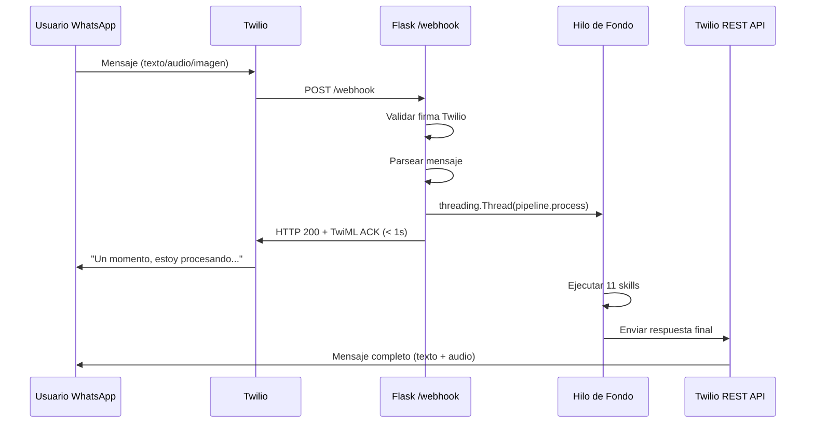
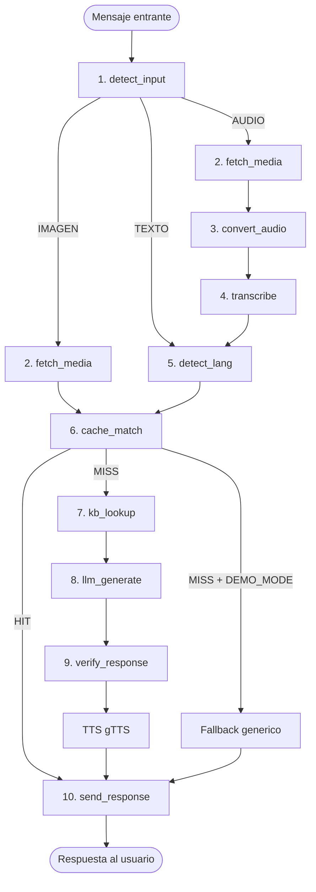

# Arquitectura de Clara — Asistente Conversacional por WhatsApp

> **Resumen en una linea:** Documentacion tecnica completa de la arquitectura de Clara: patron TwiML ACK, pipeline de 11 skills, feature flags, modelos de datos y decisiones de diseno.

## Que es

Este documento describe la arquitectura tecnica completa de Clara, el asistente conversacional WhatsApp-first del proyecto CivicAid Voice. Cubre desde el patron de comunicacion con Twilio hasta las 11 skills del pipeline, pasando por los modelos de datos, las feature flags y las decisiones de diseno fundamentales.

## Para quien

- **Desarrolladores** que necesitan entender o modificar el codigo.
- **Jurado** que quiere evaluar la calidad tecnica del proyecto.
- **Arquitectos** interesados en el patron de integracion con Twilio.

## Que incluye

- Vision general y patron TwiML ACK.
- Pipeline completo de 11 skills con diagramas.
- 9 feature flags con valores por defecto.
- 8 dataclasses de modelos de datos.
- Estructura de directorios del proyecto.
- Decisiones de diseno y sus justificaciones.

## Que NO incluye

- Guia de instalacion (ver [README.md](../../README.md)).
- Detalle de observabilidad (ver [OBSERVABILITY.md](OBSERVABILITY.md)).
- Instrucciones de deploy (ver [RENDER-DEPLOY.md](../05-ops/RENDER-DEPLOY.md)).

---

## 1. Vision General

**Clara** es un asistente conversacional disenado para poblaciones vulnerables en Espana — personas migrantes, refugiadas y en situacion de exclusion social — que necesitan orientacion sobre tramites administrativos esenciales. Clara opera exclusivamente a traves de **WhatsApp**, el canal de comunicacion mas accesible para estas comunidades, y proporciona guia paso a paso sobre 3 tramites fundamentales:

- **Ingreso Minimo Vital (IMV)** — Prestacion economica de la Seguridad Social para personas en situacion de vulnerabilidad economica.
- **Empadronamiento** — Inscripcion en el padron municipal, requisito previo para acceder a servicios publicos.
- **Tarjeta Sanitaria** — Documento que acredita el derecho a la asistencia sanitaria publica.

Clara acepta **texto, audio e imagenes** como entrada, responde en el idioma detectado del usuario (2 idiomas: espanol y frances), y devuelve tanto texto como audio pregrabado o generado por TTS para maximizar la accesibilidad.

---

## 2. Patron TwiML ACK + Respuesta Asincrona

El patron arquitectonico central de Clara resuelve una restriccion critica de la integracion con Twilio: **Twilio exige una respuesta HTTP en menos de 15 segundos**, pero el pipeline completo (transcripcion de audio + consulta LLM) puede tardar entre 4 y 18 segundos.

### Flujo del patron

1. **Twilio envia un POST** al endpoint `/webhook` de Flask con los datos del mensaje (`Body`, `From`, `NumMedia`, `MediaUrl0`, `MediaContentType0`).
2. **Flask responde inmediatamente** (en menos de 1 segundo) con un **HTTP 200** que incluye un cuerpo **TwiML XML** con un mensaje de acknowledgement:
   ```xml
   <?xml version="1.0" encoding="UTF-8"?>
   <Response>
       <Message>Un momento, estoy procesando tu consulta...</Message>
   </Response>
   ```
3. **Antes de retornar**, Flask lanza un **`threading.Thread`** que ejecuta el pipeline completo de 11 skills en segundo plano.
4. **El hilo de fondo** procesa el mensaje (transcripcion, deteccion de idioma, busqueda en cache, consulta al LLM, verificacion) y al finalizar envia la respuesta definitiva al usuario mediante la **Twilio REST API** (`client.messages.create`).

### Ventajas

- El usuario recibe feedback inmediato ("Un momento...") mientras Clara procesa.
- No hay riesgo de timeout de Twilio.
- El pipeline puede tomar el tiempo necesario para transcribir audio y generar respuestas de calidad.



---

## 3. Stack Tecnologico

| Componente | Tecnologia | Justificacion |
|------------|-----------|---------------|
| **Lenguaje** | Python 3.11 | Ecosistema ML maduro, tipado con dataclasses |
| **Framework web** | Flask | Ligero, suficiente para un webhook unico |
| **Canal** | Twilio WhatsApp Sandbox | Integracion rapida para hackathon, sin necesidad de Business API |
| **Transcripcion** | Gemini (primario) / Whisper `base` (local) | Multilingue, sin coste por API (Whisper), menor RAM (Gemini) |
| **LLM** | Gemini 1.5 Flash (Google) | Rapido, economico, ventana de contexto amplia |
| **Deteccion de idioma** | `langdetect` | Libreria ligera, soporta los idiomas objetivo |
| **Text-to-Speech** | gTTS (Google TTS) | Gratuito, multiples idiomas |
| **Base de conocimiento** | JSON estatico | Sin dependencias externas, editable, versionable |
| **Despliegue** | Render (free tier) + Docker | CI/CD automatico desde GitHub, SSL incluido |
| **Contenedorizacion** | Docker | Entorno reproducible, puerto 10000 en Render / 5000 en local |

---

## 4. Pipeline de 11 Skills

El pipeline es una cadena secuencial de 11 skills especializadas. Cada skill recibe el contexto acumulado y lo enriquece para la siguiente. El orquestador (`pipeline.py`) ejecuta las skills en orden y gestiona errores con fallbacks.

### Tabla de Skills

| # | Skill | Entrada | Salida | Timeout | Notas |
|---|-------|---------|--------|---------|-------|
| 1 | `detect_input` | IncomingMessage | InputType (TEXT/AUDIO/IMAGE) | — | Examina NumMedia y MediaContentType |
| 2 | `fetch_media` | MediaUrl | bytes (.ogg) | 10s | Solo si input_type=AUDIO/IMAGE. Usa auth de Twilio |
| 3 | `convert_audio` | bytes .ogg | bytes .wav | 5s | Usa ffmpeg. Solo si AUDIO |
| 4 | `transcribe` | bytes audio + mime_type | TranscriptResult | 12s | Gemini o Whisper base. Solo si AUDIO y WHISPER_ON=true |
| 5 | `detect_lang` | texto | idioma (es/fr) | — | langdetect. Fallback: "es" |
| 6 | `cache_match` | texto + idioma + input_type | CacheResult | — | Busqueda por keywords normalizados |
| 7 | `kb_lookup` | texto + tramite detectado | KBContext | — | Solo si cache MISS. Extrae secciones relevantes del JSON |
| 8 | `llm_generate` | texto + KBContext + idioma | LLMResponse | 6s | Solo si cache MISS y LLM_LIVE=true. Gemini 1.5 Flash |
| 9 | `verify_response` | LLMResponse + KBContext | texto verificado | — | Verifica longitud, idioma, ausencia de alucinaciones |
| 10 | `send_response` | FinalResponse | mensaje enviado | 10s | Twilio REST API. Incluye texto + URL de audio si disponible |

### Flujo Condicional

- **Texto:** Skills 1 > 5 > 6 > (7 > 8 > 9 si cache MISS) > 10
- **Audio:** Skills 1 > 2 > (3) > 4 > 5 > 6 > (7 > 8 > 9 si cache MISS) > 10
- **Imagen:** Skills 1 > 2 > 6 (match de demo para imagen) > 10

### Guardrails (opcional)

Si `GUARDRAILS_ON=true`, se ejecuta una verificacion de seguridad **antes** del pipeline (pre-check sobre la entrada del usuario) y **despues** de la generacion LLM (post-check sobre la respuesta). Si la entrada no es segura, se devuelve un mensaje de rechazo sin procesar el pipeline completo.

### Structured Outputs (opcional)

Si `STRUCTURED_OUTPUT_ON=true`, la respuesta del LLM se parsea como JSON estructurado (`ClaraStructuredResponse`) y se formatea para mostrar al usuario.

### TTS (Text-to-Speech)

Tras la verificacion, si la respuesta proviene del LLM (cache MISS), se genera un archivo de audio con gTTS y se adjunta a la respuesta final. Si la generacion de audio falla, se envia solo texto.

### Diagrama de Flujo de Datos



---

## 5. Feature Flags (10)

Las feature flags permiten controlar el comportamiento de Clara sin cambiar codigo, especialmente util para alternar entre modo demo y modo produccion. Se configuran mediante variables de entorno.

| # | Flag | Tipo | Default | Descripcion |
|---|------|------|---------|-------------|
| 1 | `DEMO_MODE` | bool | `false` | Modo demo: tras cache MISS, devuelve fallback en vez de llamar al LLM |
| 2 | `LLM_LIVE` | bool | `true` | Habilita las llamadas al LLM (Gemini). Si es false, solo cache |
| 3 | `WHISPER_ON` | bool | `true` | Habilita la transcripcion de audio. Si es false, los audios se ignoran |
| 4 | `LLM_TIMEOUT` | int | `6` (s) | Timeout maximo para la llamada a Gemini 1.5 Flash |
| 5 | `WHISPER_TIMEOUT` | int | `12` (s) | Timeout maximo para la transcripcion de audio |
| 6 | `AUDIO_BASE_URL` | str | `""` | URL base para servir los archivos de audio MP3 pregrabados |
| 7 | `OBSERVABILITY_ON` | bool | `true` | Habilita request_id, timings y lineas [OBS] en logs |
| 8 | `GUARDRAILS_ON` | bool | `true` | Habilita la capa de seguridad pre/post en el pipeline |
| 9 | `STRUCTURED_OUTPUT_ON` | bool | `false` | Habilita el parseo de respuestas LLM como JSON estructurado |
| 10 | `RAG_ENABLED` | bool | `false` | Habilita la recuperacion por vector store (stub, futuro) |

### Variables adicionales del entorno

| Variable | Tipo | Default | Descripcion |
|----------|------|---------|-------------|
| `TWILIO_ACCOUNT_SID` | str | `""` | SID de la cuenta de Twilio |
| `TWILIO_AUTH_TOKEN` | str | `""` | Token de autenticacion de Twilio |
| `TWILIO_SANDBOX_FROM` | str | `whatsapp:+14155238886` | Numero de origen del sandbox de Twilio |
| `GEMINI_API_KEY` | str | `""` | Clave API de Google Gemini |
| `FLASK_ENV` | str | `development` | Entorno de Flask |
| `LOG_LEVEL` | str | `INFO` | Nivel de log (INFO, DEBUG, WARNING, ERROR) |
| `OTEL_ENDPOINT` | str | `""` | Endpoint de OpenTelemetry (stub, futuro) |
| `ADMIN_TOKEN` | str | `""` | Token de administracion |

### Combinaciones tipicas

| Escenario | DEMO_MODE | LLM_LIVE | WHISPER_ON | GUARDRAILS_ON |
|-----------|-----------|----------|------------|---------------|
| Demo en hackathon | `true` | `true` | `true` | `true` |
| Solo cache (sin APIs) | `true` | `false` | `false` | `false` |
| Produccion completa | `false` | `true` | `true` | `true` |
| Desarrollo local (sin audio) | `false` | `true` | `false` | `true` |

---

## 6. Modelos de Datos (8 Dataclasses)

Todas las estructuras de datos estan definidas como `dataclasses` de Python en `src/core/models.py` para garantizar tipado, claridad en las interfaces entre skills, y facilidad de serializacion.

### InputType (Enum)

```python
class InputType(Enum):
    TEXT = "text"
    AUDIO = "audio"
    IMAGE = "image"
```

Define los 3 tipos de entrada que Clara puede recibir.

### IncomingMessage

```python
@dataclass
class IncomingMessage:
    from_number: str          # Numero del remitente (whatsapp:+34...)
    body: str                 # Texto del mensaje (vacio si es audio)
    media_url: Optional[str]  # URL del primer adjunto
    media_type: Optional[str] # MIME type (audio/ogg, image/jpeg)
    input_type: InputType     # Tipo detectado por detect_input
    timestamp: float          # Epoch del momento de recepcion
    request_id: str           # ID unico de observabilidad
```

Mensaje entrante parseado desde el POST de Twilio.

### AckResponse

```python
@dataclass
class AckResponse:
    message: str    # Texto del ACK (localizado)
    twiml_xml: str  # XML completo de TwiML
```

TwiML XML devuelto como HTTP 200 inmediato.

### TranscriptResult

```python
@dataclass
class TranscriptResult:
    text: str                  # Texto transcrito
    language: str              # Idioma detectado
    duration_ms: int           # Milisegundos de procesamiento
    success: bool              # True si la transcripcion fue exitosa
    error: Optional[str]       # Mensaje de error si fallo
```

Resultado de la transcripcion de audio.

### CacheEntry

```python
@dataclass
class CacheEntry:
    id: str                     # Identificador unico (ej: "ahmed_empadronamiento_fr")
    patterns: List[str]         # Keywords para matching (ej: ["inscrire", "mairie"])
    match_mode: str             # "any_keyword" | "image_demo"
    idioma: str                 # Idioma de la respuesta: "fr" | "es" | "any"
    respuesta: str              # Texto completo de la respuesta
    audio_file: Optional[str]   # Nombre del MP3 asociado
```

Entrada individual en `demo_cache.json`. El sistema contiene 8 entradas precalculadas.

### CacheResult

```python
@dataclass
class CacheResult:
    hit: bool                         # True si se encontro coincidencia
    entry: Optional[CacheEntry]       # Entrada encontrada (None si miss)
    score: float                      # Puntuacion de coincidencia (0.0-1.0)
```

Resultado de la busqueda en cache.

### KBContext

```python
@dataclass
class KBContext:
    tramite: str          # Nombre del tramite identificado
    datos: dict           # Datos estructurados del JSON del tramite
    fuente_url: str       # URL oficial de referencia
    verificado: bool      # Si los datos estan verificados oficialmente
```

Contexto extraido de la base de conocimiento para enviar al LLM.

### LLMResponse

```python
@dataclass
class LLMResponse:
    text: str             # Texto de la respuesta
    language: str         # Idioma de la respuesta
    duration_ms: int      # Milisegundos de generacion
    from_cache: bool      # True si se uso cache en vez de LLM
    success: bool         # True si la generacion fue exitosa
    error: Optional[str]  # Mensaje de error si fallo
```

Respuesta generada por Gemini.

### FinalResponse

```python
@dataclass
class FinalResponse:
    to_number: str                   # Numero destino (whatsapp:+34...)
    body: str                        # Texto de la respuesta
    media_url: Optional[str]         # URL del audio MP3
    source: str                      # Origen: "cache" | "llm" | "fallback" | "guardrail"
    total_ms: int                    # Tiempo total de procesamiento en ms
```

Respuesta final enviada al usuario por Twilio REST.

---

## 7. Estructura de Directorios

```
civicaid-voice/
├── src/
│   ├── app.py                    # Punto de entrada Flask — create_app() + blueprints
│   │
│   ├── routes/
│   │   ├── webhook.py            # POST /webhook — entrada principal de Twilio
│   │   ├── health.py             # GET /health — healthcheck (8 componentes)
│   │   └── static_files.py       # GET /static/cache/* — servir audios MP3
│   │
│   ├── core/
│   │   ├── config.py             # Variables de entorno y 9 feature flags (dataclass Config)
│   │   ├── cache.py              # Carga demo_cache.json + delega matching a cache_match
│   │   ├── pipeline.py           # Orquestador del pipeline de 11 skills
│   │   ├── models.py             # 8 dataclasses: IncomingMessage, CacheEntry, FinalResponse...
│   │   ├── models_structured.py  # Parseo de salidas estructuradas (opcional)
│   │   ├── guardrails.py         # Capa de seguridad pre/post (opcional)
│   │   ├── twilio_client.py      # Wrapper de Twilio REST API
│   │   │
│   │   ├── skills/
│   │   │   ├── detect_input.py   # Skill 1: Detectar tipo de entrada (texto/audio/imagen)
│   │   │   ├── fetch_media.py    # Skill 2: Descargar media desde Twilio (con auth)
│   │   │   ├── convert_audio.py  # Skill 3: Convertir OGG a WAV con ffmpeg
│   │   │   ├── transcribe.py     # Skill 4: Transcribir audio con Gemini/Whisper
│   │   │   ├── detect_lang.py    # Skill 5: Detectar idioma con langdetect
│   │   │   ├── cache_match.py    # Skill 6: Buscar coincidencia en cache por keywords
│   │   │   ├── kb_lookup.py      # Skill 7: Buscar contexto en base de conocimiento JSON
│   │   │   ├── llm_generate.py   # Skill 8: Generar respuesta con Gemini 1.5 Flash
│   │   │   ├── verify_response.py # Skill 9: Verificar calidad y seguridad de respuesta
│   │   │   ├── send_response.py  # Skill 10: Enviar respuesta final por Twilio REST
│   │   │   └── tts.py            # Text-to-Speech con gTTS
│   │   │
│   │   └── prompts/
│   │       ├── system_prompt.py  # Prompt del sistema para Gemini
│   │       └── templates.py      # Plantillas de ACK, fallback y errores (es/fr)
│   │
│   └── utils/
│       ├── logger.py             # Logging estructurado con 7 funciones tagged
│       ├── timing.py             # Decorador @timed para medir tiempos de skills
│       └── observability.py      # RequestContext, request_id, hooks Flask
│
├── data/
│   ├── cache/
│   │   ├── demo_cache.json       # 8 respuestas precalculadas para demo
│   │   └── *.mp3                 # 6 audios pregrabados (es x 3 + fr x 2 + vision)
│   │
│   └── tramites/
│       ├── imv.json              # Base de conocimiento: Ingreso Minimo Vital
│       ├── empadronamiento.json  # Base de conocimiento: Empadronamiento
│       └── tarjeta_sanitaria.json # Base de conocimiento: Tarjeta Sanitaria
│
├── tests/
│   ├── unit/                     # Tests unitarios
│   ├── integration/              # Tests de integracion
│   └── e2e/                      # Tests end-to-end
│
├── docs/                         # 29 documentos de documentacion
├── scripts/                      # Scripts de operacion y verificacion
├── Dockerfile                    # Python 3.11 + gunicorn (puerto 10000)
├── render.yaml                   # Render Blueprint
├── pyproject.toml                # Configuracion de proyecto y herramientas
├── requirements.txt              # 10 dependencias core
└── requirements-audio.txt        # Whisper/audio (opcional en macOS)
```

---

## 8. Decisiones de Diseno

### 8.1 Cache-first para fiabilidad en demo

En un contexto de hackathon, la fiabilidad de la demo es critica. Las APIs externas (Gemini, Whisper) pueden fallar, tener latencia variable o devolver respuestas inconsistentes. El enfoque **cache-first** garantiza que los escenarios de demo mas comunes (preguntas sobre IMV, empadronamiento, tarjeta sanitaria en espanol y frances) siempre producen una respuesta inmediata, consistente y con audio pregrabado. El LLM solo interviene cuando la cache no tiene una respuesta adecuada.

### 8.2 JSON en vez de base de datos

Clara maneja informacion sobre exactamente **3 tramites administrativos**. La base de conocimiento completa cabe en menos de 50 KB de JSON. Introducir una base de datos (PostgreSQL, SQLite, Redis) anadiria complejidad de configuracion, dependencia adicional en el despliegue, y overhead innecesario. Los archivos JSON son versionables en Git, editables con cualquier editor, y se cargan en memoria al inicio de la aplicacion.

### 8.3 Una sola llamada al LLM

Arquitecturas multi-agente (un agente para clasificar, otro para responder, otro para verificar) multiplican la latencia y el coste. Clara usa **una unica llamada a Gemini 1.5 Flash** con un prompt que incluye el system prompt, el contexto de la KB, y el mensaje del usuario. La verificacion posterior (Skill 9) es una validacion programatica local, no otra llamada al LLM.

### 8.4 Gemini como alternativa a Whisper para transcripcion

El tier gratuito de Render asigna **512 MB de RAM**. Whisper `base` requiere ~290 MB solo para el modelo, dejando poco margen. En la Fase 2 se anadio transcripcion via Gemini como alternativa: se envia el audio directamente a la API de Gemini, que devuelve la transcripcion. Esto elimina la necesidad de cargar un modelo local en memoria, a cambio de una dependencia de red.

### 8.5 Feature flags para flexibilidad

Las 10 feature flags permiten configurar Clara para distintos escenarios sin cambiar codigo: demo con cache-only, desarrollo local sin audio, produccion completa con todos los modulos activados. Esto es critico para un hackathon donde las condiciones del entorno cambian rapidamente.

---

## 9. Diagramas

Los diagramas visuales de la arquitectura se encuentran en archivos Mermaid junto a este documento:

| Diagrama | Archivo | Descripcion |
|----------|---------|-------------|
| Secuencia TwiML ACK + REST | [`sequence-wa-ack-rest.mmd`](sequence-wa-ack-rest.mmd) | Flujo temporal completo desde WhatsApp hasta la respuesta final |
| Flujo de datos | [`dataflow.mmd`](dataflow.mmd) | Pipeline de 11 skills como flowchart con bifurcaciones |
| Componentes | [`components.mmd`](components.mmd) | Vista estatica de modulos y dependencias |
| Deploy y operaciones | [`deploy-ops-flow.mmd`](deploy-ops-flow.mmd) | Ciclo de keep-alive con cron cada 14 min, flujo de mensajes, logging |

---

## 10. Referencias Rapidas

| Recurso | Ubicacion |
|---------|-----------|
| Punto de entrada | [`src/app.py`](../../src/app.py) — `create_app()` registra blueprints |
| Configuracion | [`src/core/config.py`](../../src/core/config.py) — dataclass `Config` con 10 feature flags |
| Pipeline | [`src/core/pipeline.py`](../../src/core/pipeline.py) — orquestador `process()` |
| Skills (11) | [`src/core/skills/*.py`](../../src/core/skills/) |
| Modelos (8) | [`src/core/models.py`](../../src/core/models.py) — 8 dataclasses |
| Plantillas | [`src/core/prompts/templates.py`](../../src/core/prompts/templates.py) — ACK, fallback, errores |
| Base de conocimiento | [`data/tramites/*.json`](../../data/tramites/) — 3 tramites |
| Cache de demo | [`data/cache/demo_cache.json`](../../data/cache/demo_cache.json) — 8 entradas |
| Tests | [`tests/`](../../tests/) — 96 tests (unit, integration, e2e) |
| Dockerfile | [`Dockerfile`](../../Dockerfile) — puerto 10000 (Render) / 5000 (local) |
| Despliegue | [`render.yaml`](../../render.yaml) — Render free tier con auto-deploy desde main |
| Observabilidad | [`OBSERVABILITY.md`](OBSERVABILITY.md) — logs, tags, timings, /health |
| Indice de docs | [`docs/00-DOCS-INDEX.md`](../00-DOCS-INDEX.md) — navegacion completa |

---

## Como se verifica

```bash
# Ejecutar los 96 tests
pytest tests/ -q

# Verificar que el pipeline se ejecuta correctamente
pytest tests/integration/test_pipeline.py -v

# Verificar el endpoint /health (8 componentes)
curl http://localhost:5000/health | python3 -m json.tool

# Lint del codigo fuente
ruff check src/ tests/ --select E,F,W --ignore E501
```

## Referencias

- [Indice de Documentacion](../00-DOCS-INDEX.md)
- [Resumen Ejecutivo](../00-EXECUTIVE-SUMMARY.md)
- [Observabilidad](OBSERVABILITY.md)
- [Guia de Deploy en Render](../05-ops/RENDER-DEPLOY.md)
- [README.md](../../README.md)
