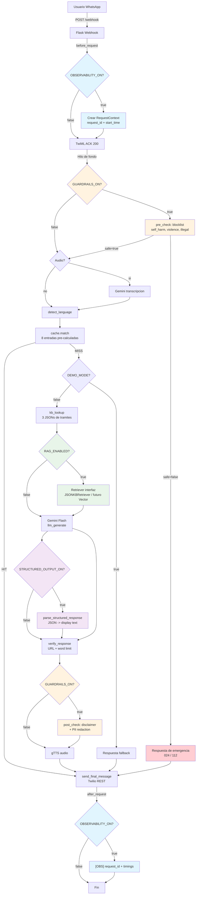

# Integracion del Toolkit -- CivicAid Voice / Clara

> **Resumen en una linea:** Clara integra 5 componentes del toolkit (Observability, Structured Outputs, Guardrails, Evals, RAG) controlados por feature flags independientes, permitiendo activacion gradual sin riesgo para el pipeline principal.

## Que es

La integracion del toolkit de Clara es un conjunto de 5 modulos transversales que complementan el pipeline principal de 11 skills. Cada modulo se activa/desactiva con una feature flag independiente y esta disenado con un patron "zero breakage": si se activa y falla, el pipeline continua con el comportamiento por defecto.

## Para quien

- **Desarrolladores** que implementan o extienden los modulos del toolkit.
- **Arquitectos** que necesitan entender como los modulos transversales interactuan con el pipeline.
- **QA** que valida que cada modulo funciona correctamente aislado y en conjunto.

## Que incluye

- Las 5 integraciones del toolkit con su estado actual.
- Diagrama Mermaid del flujo completo.
- Feature flags correspondientes con valores por defecto.
- Comandos de verificacion para cada modulo.

## Que NO incluye

- Detalle de implementacion de cada modulo (ver documentos especificos).
- Configuracion de infraestructura externa (Grafana, FAISS, etc.).
- Pipeline principal de 11 skills (ver `docs/02-architecture/ARCHITECTURE.md`).

---

## 1. Vision general del Toolkit

El toolkit extiende el pipeline de Clara con capacidades transversales. Cada modulo sigue estos principios:

1. **Feature flag independiente:** Se activa/desactiva sin tocar codigo.
2. **Zero breakage:** Si el modulo falla, el pipeline continua sin el.
3. **Sin dependencias cruzadas:** Los modulos del toolkit no dependen entre si.
4. **Tests aislados:** Cada modulo tiene su propia suite de tests.

### Las 5 integraciones

| # | Modulo | Feature flag | Valor por defecto | Estado |
|---|--------|-------------|-------------------|--------|
| 1 | Observability | `OBSERVABILITY_ON` | `true` | **Activo** -- request_id, timings, lineas [OBS] |
| 2 | Structured Outputs | `STRUCTURED_OUTPUT_ON` | `false` | **Stub** -- codigo completo, deshabilitado |
| 3 | Guardrails | `GUARDRAILS_ON` | `true` | **Activo** -- pre/post check, PII, disclaimers |
| 4 | Evals | (framework de testing) | siempre disponible | **Activo** -- 4 sets, 16+ casos, pytest |
| 5 | RAG | `RAG_ENABLED` | `false` | **Stub** -- interfaz Retriever, JSON backend |

---

## 2. Diagrama Mermaid -- Flujo del Toolkit en el Pipeline



**Leyenda de colores:**
- Azul claro: Observability
- Naranja claro: Guardrails
- Violeta claro: Structured Outputs
- Verde claro: RAG

---

## 3. Detalle de cada integracion

### 3.1 Observability (`OBSERVABILITY_ON`)

**Proposito:** Trazar cada peticion de principio a fin con un `request_id` unico, registrar timings por etapa del pipeline y emitir lineas de log resumen `[OBS]`.

**Implementacion:**

| Archivo | Funcion |
|---------|---------|
| `src/utils/observability.py` | `RequestContext`, hooks Flask `before_request` / `after_request` |
| `src/utils/logger.py` | 7 funciones de log etiquetadas (`log_ack`, `log_cache`, `log_whisper`, `log_llm`, `log_rest`, `log_error`, `log_observability`) |
| `src/utils/timing.py` | Decorador `@timed()` para medir cada skill |
| `src/routes/health.py` | Endpoint `GET /health` con estado de componentes |

**Tags de log:** `[ACK]`, `[CACHE]`, `[WHISPER]`, `[LLM]`, `[REST]`, `[ERROR]`, `[OBS]`, `[TIMING]`

**Estado:** Activo por defecto. Funciona en produccion.

**Configuracion adicional:**
- `OTEL_ENDPOINT`: Stub para futuro export OpenTelemetry (no implementado).
- `LOG_LEVEL=DEBUG`: Activa lineas `[TIMING]` por skill.

**Verificacion:**
```bash
curl -s http://localhost:5000/health | python3 -m json.tool
pytest tests/unit/test_observability.py -v
```

---

### 3.2 Structured Outputs (`STRUCTURED_OUTPUT_ON`)

**Proposito:** Instruir a Gemini Flash para que responda en JSON tipado con campos estandarizados (intent, tramite, pasos, documentos, fuentes, disclaimer). El JSON se transforma en texto formateado para WhatsApp.

**Implementacion:**

| Archivo | Funcion |
|---------|---------|
| `src/core/models_structured.py` | Modelo Pydantic `ClaraStructuredResponse`, funcion `parse_structured_response()` |
| `src/core/skills/llm_generate.py` | Inyeccion del schema JSON en el prompt (lineas 36-42) |
| `src/core/pipeline.py` | Llamada a `parse_structured_response()` tras verify (lineas 119-123) |

**Schema:** 9 campos -- `intent`, `language`, `tramite`, `summary`, `steps`, `required_docs`, `warnings`, `sources`, `disclaimer`.

**Patron de seguridad:** Si el parseo JSON falla, se devuelve el texto original sin modificar (zero breakage).

**Estado:** Stub -- codigo completo, deshabilitado por defecto (`STRUCTURED_OUTPUT_ON=false`).

**Verificacion:**
```bash
pytest tests/unit/test_structured_outputs.py -v
python3 -c "from src.core.config import Config; print(Config().STRUCTURED_OUTPUT_ON)"
# Resultado esperado: False
```

---

### 3.3 Guardrails (`GUARDRAILS_ON`)

**Proposito:** Proteger a los usuarios vulnerables con dos capas de seguridad determinista (sin LLM):
- **Pre-check:** Bloquea entradas peligrosas (autolesion, violencia, ilegalidades) y devuelve recursos de emergencia.
- **Post-check:** Redacta PII (DNI, NIE, telefono) y anade disclaimers legales/medicos a la respuesta del LLM.

**Implementacion:**

| Archivo | Funcion |
|---------|---------|
| `src/core/guardrails.py` | `pre_check()`, `post_check()`, `BLOCKED_PATTERNS`, `PII_PATTERNS`, `LEGAL_DISCLAIMER` |
| `src/core/pipeline.py` | Llamada a `pre_check()` al inicio (lineas 36-48), `post_check()` tras verify (lineas 126-128) |

**Categorias bloqueadas:** `self_harm` (024), `violence` (112), `illegal` (profesional legal).

**PII redactada:** DNI (`\d{8}[A-Z]`), NIE (`[XYZ]\d{7}[A-Z]`), telefono (`\d{3}[-.]?\d{3}[-.]?\d{3}`).

**Estado:** Activo por defecto (`GUARDRAILS_ON=true`). Habilitado en produccion.

**Verificacion:**
```bash
pytest tests/unit/test_guardrails.py -v
pytest tests/unit/test_redteam.py -v
python3 -c "from src.core.config import Config; print(Config().GUARDRAILS_ON)"
# Resultado esperado: True
```

---

### 3.4 Evals (framework de evaluacion)

**Proposito:** Validar la calidad de las respuestas de Clara contra casos de prueba predefinidos. Cada caso especifica una consulta, que debe contener la respuesta (`expected_contains`) y que no debe contener (`expected_not_contains`).

**Implementacion:**

| Archivo | Funcion |
|---------|---------|
| `src/utils/eval_runner.py` | `load_eval_cases()`, `run_eval_case()`, `run_eval_set()`, `generate_report_markdown()` |
| `data/evals/*.json` | 4+ sets de evaluacion: `imv_evals.json`, `empadronamiento_evals.json`, `tarjeta_evals.json`, `safety_evals.json`, `redteam_prompts.json` |
| `tests/unit/test_evals.py` | 8 tests del framework de evaluacion |

**Sets de evaluacion:**

| Set | Archivo | Que valida |
|-----|---------|-----------|
| IMV | `data/evals/imv_evals.json` | Respuestas sobre el Ingreso Minimo Vital |
| Empadronamiento | `data/evals/empadronamiento_evals.json` | Respuestas sobre empadronamiento |
| Tarjeta sanitaria | `data/evals/tarjeta_evals.json` | Respuestas sobre la tarjeta sanitaria |
| Seguridad | `data/evals/safety_evals.json` | Respuestas de seguridad (autolesion, violencia) |
| Red team | `data/evals/redteam_prompts.json` | Intentos de evasion de guardrails |

**Metricas:**
- `score`: 0.0 a 1.0 (ratio de checks pasados).
- `passed/failed`: Conteo agregado por set.
- `avg_score`: Media del set.
- Reporte markdown generado automaticamente.

**Estado:** Activo -- no tiene feature flag, siempre disponible. Se ejecuta como parte del test suite.

**No tiene feature flag** porque es un framework de testing, no un componente del pipeline de produccion.

**Verificacion:**
```bash
pytest tests/unit/test_evals.py -v
# Ejecutar evals contra cache real
python3 -c "
from src.utils.eval_runner import load_eval_cases, run_eval_set, generate_report_markdown
from src.core import cache
from src.core.models import InputType
cache.load_cache()
cases = load_eval_cases('data/evals')
reports = []
for name, c in cases.items():
    def get_resp(q, l, _c=cache):
        r = _c.match(q, l, InputType.TEXT)
        return r.entry.respuesta if r.hit and r.entry else ''
    reports.append(run_eval_set(name, c, get_resp))
print(generate_report_markdown(reports))
"
```

---

### 3.5 RAG (`RAG_ENABLED`)

**Proposito:** Abstraer el acceso a la base de conocimiento (KB) detras de una interfaz `Retriever`, preparando la transicion de busqueda por palabras clave (actual) a busqueda vectorial (futuro con FAISS o Chroma).

**Implementacion:**

| Archivo | Funcion |
|---------|---------|
| `src/core/retriever.py` | Clase abstracta `Retriever`, implementacion `JSONKBRetriever`, factory `get_retriever()` |
| `src/core/skills/kb_lookup.py` | Backend actual de busqueda por palabras clave en archivos JSON |
| `data/tramites/*.json` | 3 bases de conocimiento: `imv.json`, `empadronamiento.json`, `tarjeta_sanitaria.json` |
| `tests/unit/test_retriever.py` | 5 tests de la interfaz Retriever |

**Arquitectura de la interfaz:**

```
Retriever (ABC)
    |
    +-- JSONKBRetriever  <-- Actual (busqueda por palabras clave)
    |
    +-- VectorRetriever  <-- Futuro (FAISS/Chroma, placeholder comentado)
```

**Factory:** `get_retriever()` devuelve `JSONKBRetriever` actualmente. Cuando se implemente el retriever vectorial, la factory elegira basandose en `RAG_ENABLED`.

**Estado:** Stub -- la interfaz `Retriever` esta definida y `JSONKBRetriever` funciona, pero `VectorRetriever` es solo un placeholder comentado. La flag `RAG_ENABLED=false` por defecto.

**Pasos para implementacion futura:**
1. `pip install faiss-cpu` (o `chromadb`).
2. Implementar `VectorRetriever` con embedding de documentos al arranque.
3. Actualizar `get_retriever()` para devolver `VectorRetriever` cuando `RAG_ENABLED=true`.
4. Configurar `RAG_ENABLED=true` en variables de entorno.

**Verificacion:**
```bash
pytest tests/unit/test_retriever.py -v
python3 -c "from src.core.config import Config; print(Config().RAG_ENABLED)"
# Resultado esperado: False
```

---

## 4. Tabla completa de feature flags

Clara cuenta con 9 feature flags configurables por variables de entorno:

| # | Flag | Variable de entorno | Valor por defecto | Tipo | Proposito |
|---|------|---------------------|-------------------|------|-----------|
| 1 | Modo demo | `DEMO_MODE` | `false` | bool | Solo cache, sin LLM tras cache miss |
| 2 | LLM activo | `LLM_LIVE` | `true` | bool | Habilita llamadas a Gemini Flash |
| 3 | Whisper activo | `WHISPER_ON` | `true` | bool | Habilita transcripcion de audio |
| 4 | Timeout LLM | `LLM_TIMEOUT` | `6` | int (seg) | Timeout maximo para llamadas a Gemini |
| 5 | Timeout Whisper | `WHISPER_TIMEOUT` | `12` | int (seg) | Timeout maximo para transcripcion |
| 6 | URL base audio | `AUDIO_BASE_URL` | `""` | str | URL publica para servir archivos MP3 |
| 7 | Observabilidad | `OBSERVABILITY_ON` | `false` | bool | request_id, timings, lineas [OBS] |
| 8 | Structured Outputs | `STRUCTURED_OUTPUT_ON` | `false` | bool | Respuestas JSON tipadas |
| 9 | Guardrails | `GUARDRAILS_ON` | `false` | bool | Pre/post check de seguridad |
| 10 | RAG | `RAG_ENABLED` | `false` | bool | Interfaz Retriever para busqueda vectorial |

---

## 5. Numeros clave del proyecto

| Metrica | Valor |
|---------|-------|
| Tests totales | 96 (91 passed + 5 xpassed) |
| Skills del pipeline | 11 |
| Feature flags | 9 |
| Entradas de cache | 8 |
| Entradas de Notion | 81 (43 + 12 + 26) |
| Intervalo cron (keep-alive) | 14 minutos |
| Puerto Render | 10000 |
| Puerto local | 5000 |
| Python | 3.11 |

---

## Como se verifica

### Verificacion rapida de todas las integraciones

```bash
# 1. Ejecutar todos los tests (93 total)
pytest tests/ -v --tb=short

# 2. Verificar health endpoint (local)
curl -s http://localhost:5000/health | python3 -m json.tool

# 3. Verificar valores de feature flags
python3 -c "
from src.core.config import Config
c = Config()
print(f'OBSERVABILITY_ON={c.OBSERVABILITY_ON}')
print(f'STRUCTURED_OUTPUT_ON={c.STRUCTURED_OUTPUT_ON}')
print(f'GUARDRAILS_ON={c.GUARDRAILS_ON}')
print(f'RAG_ENABLED={c.RAG_ENABLED}')
"

# 4. Tests por modulo del toolkit
pytest tests/unit/test_observability.py -v     # Observability
pytest tests/unit/test_structured_outputs.py -v # Structured Outputs
pytest tests/unit/test_guardrails.py -v         # Guardrails
pytest tests/unit/test_redteam.py -v            # Guardrails (red team)
pytest tests/unit/test_evals.py -v              # Evals
pytest tests/unit/test_retriever.py -v          # RAG

# 5. Lint
ruff check src/ tests/ --select E,F,W --ignore E501
```

---

## Referencias

| Recurso | Ubicacion |
|---------|-----------|
| Observabilidad (detalle) | `docs/05-ops/OBSERVABILITY-QUICKSTART.md` |
| Structured Outputs y Guardrails (detalle) | `docs/05-ops/STRUCTURED-OUTPUTS-GUARDRAILS.md` |
| Arquitectura del pipeline | `docs/02-architecture/ARCHITECTURE.md` |
| Configuracion centralizada | `src/core/config.py` |
| Pipeline orquestador | `src/core/pipeline.py` |
| Modulo observabilidad | `src/utils/observability.py` |
| Logger estructurado | `src/utils/logger.py` |
| Decorador timing | `src/utils/timing.py` |
| Modelo structured output | `src/core/models_structured.py` |
| Modulo guardrails | `src/core/guardrails.py` |
| Framework evals | `src/utils/eval_runner.py` |
| Datos de evaluacion | `data/evals/*.json` |
| Interfaz Retriever (RAG) | `src/core/retriever.py` |
| KB lookup (backend JSON) | `src/core/skills/kb_lookup.py` |
| Tests del toolkit | `tests/unit/test_observability.py`, `tests/unit/test_structured_outputs.py`, `tests/unit/test_guardrails.py`, `tests/unit/test_evals.py`, `tests/unit/test_retriever.py` |
