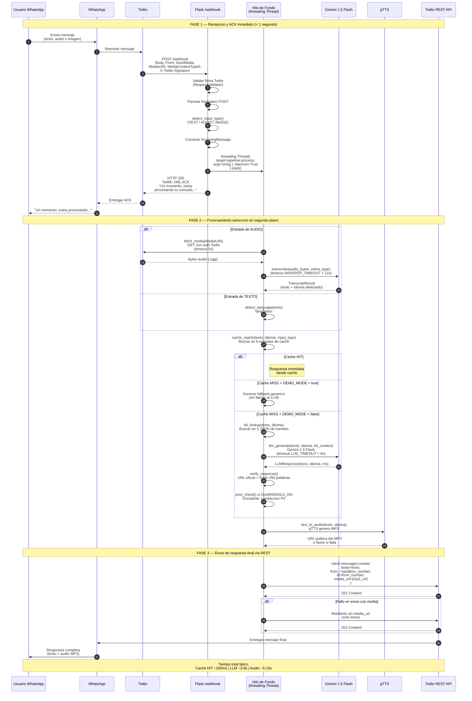
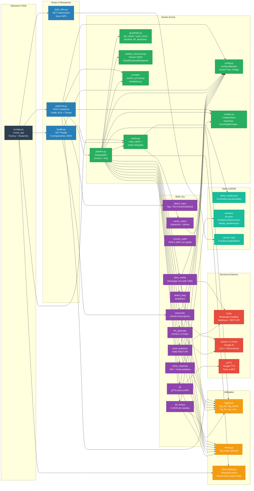

# SECCION 5: Diagramas Mermaid

> **Contexto:** Diagramas tecnicos de la arquitectura de Clara (CivicAid Voice) para la reestructuracion del Notion OS. Todos los flujos reflejan el codigo fuente real del repositorio. Cada diagrama incluye etiquetas en espanol y referencias a los archivos fuente correspondientes.

---

## Diagrama 1: Flujo Completo del Pipeline

**Que muestra:** El recorrido completo de un mensaje desde la recepcion en el webhook de Twilio hasta el envio de la respuesta final. Incluye las 11 skills como nodos, los puntos de decision (cache hit/miss, audio/texto, guardrails bloqueo/paso, modo demo), y codificacion por colores: verde = camino feliz, naranja = fallback, rojo = bloqueado.

**Archivos fuente:** `src/core/pipeline.py`, `src/routes/webhook.py`, `src/core/guardrails.py`, `src/core/config.py`

```mermaid
flowchart TD
    classDef happy fill:#2ecc71,stroke:#27ae60,color:#fff
    classDef fallback fill:#e67e22,stroke:#d35400,color:#fff
    classDef blocked fill:#e74c3c,stroke:#c0392b,color:#fff
    classDef decision fill:#3498db,stroke:#2980b9,color:#fff
    classDef skill fill:#ecf0f1,stroke:#95a5a6,color:#2c3e50
    classDef external fill:#9b59b6,stroke:#8e44ad,color:#fff

    START([Twilio POST /webhook]):::external --> VALIDATE{Firma Twilio valida?}:::decision
    VALIDATE -->|No| REJECT[403 Forbidden]:::blocked
    VALIDATE -->|Si| PARSE[Parsear Body, From, NumMedia, MediaUrl0]:::skill

    PARSE --> S1[S1: detect_input<br/>Detectar tipo entrada]:::skill
    S1 --> ACK[Responder TwiML ACK<br/>HTTP 200 inmediato]:::happy
    ACK --> THREAD[Lanzar threading.Thread<br/>pipeline.process]

    THREAD --> GRD_PRE{GUARDRAILS_ON?}:::decision
    GRD_PRE -->|No| TYPE_CHECK
    GRD_PRE -->|Si| PRE_CHECK[pre_check: blocklist<br/>autolesion / violencia / ilegal]:::skill
    PRE_CHECK --> PRE_SAFE{Entrada segura?}:::decision
    PRE_SAFE -->|No| BLOCK_MSG[Mensaje de rechazo<br/>ej: Llama al 024 / 112]:::blocked
    BLOCK_MSG --> S10_BLK[S10: send_response<br/>Twilio REST]:::blocked
    S10_BLK --> FIN_BLK([Usuario recibe rechazo]):::blocked
    PRE_SAFE -->|Si| TYPE_CHECK

    TYPE_CHECK{Tipo de entrada?}:::decision
    TYPE_CHECK -->|TEXTO| S5[S5: detect_lang<br/>langdetect]:::skill
    TYPE_CHECK -->|AUDIO + media_url| S2[S2: fetch_media<br/>Descargar audio con auth Twilio]:::skill
    TYPE_CHECK -->|IMAGEN| S6_IMG[S6: cache_match<br/>match_mode = image_demo]:::skill

    S2 --> FETCH_OK{Descarga exitosa?}:::decision
    FETCH_OK -->|No| FB_WHISPER[Fallback: whisper_fail]:::fallback
    FB_WHISPER --> S10_FB1[S10: send_response]:::fallback
    S10_FB1 --> FIN_FB1([Usuario recibe fallback]):::fallback

    FETCH_OK -->|Si| S4[S4: transcribe<br/>Gemini 1.5 Flash<br/>timeout WHISPER_TIMEOUT]:::skill

    S4 --> TRANS_OK{Transcripcion exitosa?}:::decision
    TRANS_OK -->|No| FB_WHISPER2[Fallback: whisper_fail]:::fallback
    FB_WHISPER2 --> S10_FB2[S10: send_response]:::fallback
    S10_FB2 --> FIN_FB2([Usuario recibe fallback]):::fallback
    TRANS_OK -->|Si: texto + idioma| S6

    S5 --> S6[S6: cache_match<br/>Keywords + idioma + input_type]:::skill
    S6_IMG --> CACHE_HIT_IMG{Cache HIT?}:::decision
    CACHE_HIT_IMG -->|Si| S10_CACHE_IMG[S10: send_response]:::happy
    S10_CACHE_IMG --> FIN_IMG([Usuario recibe respuesta cache]):::happy
    CACHE_HIT_IMG -->|No| FB_IMG[Fallback generico]:::fallback
    FB_IMG --> S10_FB_IMG[S10: send_response]:::fallback
    S10_FB_IMG --> FIN_FB_IMG([Usuario recibe fallback]):::fallback

    S6 --> CACHE{Cache HIT?}:::decision
    CACHE -->|Si| S10_CACHE[S10: send_response<br/>+ audio pregrabado si existe]:::happy
    S10_CACHE --> FIN_CACHE([Usuario recibe respuesta cache]):::happy

    CACHE -->|No - MISS| DEMO{DEMO_MODE?}:::decision
    DEMO -->|Si| FB_DEMO[Fallback generico<br/>Sin llamar al LLM]:::fallback
    FB_DEMO --> S10_DEMO[S10: send_response]:::fallback
    S10_DEMO --> FIN_DEMO([Usuario recibe fallback]):::fallback

    DEMO -->|No| S7[S7: kb_lookup<br/>Buscar en 3 JSON:<br/>IMV, Empadronamiento,<br/>Tarjeta Sanitaria]:::skill
    S7 --> S8[S8: llm_generate<br/>Gemini 1.5 Flash<br/>timeout LLM_TIMEOUT]:::skill
    S8 --> S9[S9: verify_response<br/>URL oficial + limite 250 palabras]:::skill

    S9 --> STRUCT{STRUCTURED_OUTPUT_ON?}:::decision
    STRUCT -->|Si| PARSE_JSON[Parsear JSON estructurado<br/>ClaraStructuredResponse]:::skill
    STRUCT -->|No| GRD_POST
    PARSE_JSON --> GRD_POST

    GRD_POST{GUARDRAILS_ON?}:::decision
    GRD_POST -->|Si| POST_CHECK[post_check:<br/>disclaimer legal/medico<br/>+ redaccion PII]:::skill
    GRD_POST -->|No| TTS_CHECK
    POST_CHECK --> TTS_CHECK

    TTS_CHECK[TTS: gTTS<br/>Generar MP3 del texto]:::skill
    TTS_CHECK --> S10[S10: send_response<br/>Twilio REST API<br/>texto + audio MP3]:::happy
    S10 --> FIN([Usuario recibe respuesta completa]):::happy
```

---

## Diagrama 2: Diagrama de Secuencia — Patron TwiML ACK

**Que muestra:** La interaccion temporal completa entre todos los participantes del sistema: Usuario, WhatsApp, Twilio, Flask /webhook, el hilo de fondo que ejecuta el pipeline, los servicios externos (Gemini, gTTS) y la Twilio REST API para el envio final. Se destaca el patron TwiML ACK: respuesta inmediata HTTP 200 + procesamiento asincrono en segundo plano.

**Archivos fuente:** `src/routes/webhook.py`, `src/core/pipeline.py`, `src/core/skills/send_response.py`

---

## Diagrama 3: Arquitectura de Modulos

**Que muestra:** La estructura de componentes del sistema y las dependencias entre ellos. Organizado en capas: la aplicacion Flask, las rutas (webhook, health, static), el nucleo (pipeline, config, cache, guardrails, modelos), las 11 skills, las utilidades (observabilidad, logger, timing), y los servicios externos (Twilio, Gemini, gTTS). Las flechas indican direccion de dependencia (quien importa a quien).

**Archivos fuente:** `src/app.py`, `src/core/pipeline.py`, `src/core/config.py`, `src/routes/*.py`, `src/core/skills/*.py`, `src/utils/*.py`

---

## Diagrama 4: Maquina de Estados del Mensaje

**Que muestra:** Los estados por los que pasa un mensaje desde su recepcion hasta el envio de la respuesta final. Incluye bifurcaciones para el camino de audio versus texto, el chequeo de cache (hit/miss), el modo demo, y los estados de error con sus fallbacks correspondientes. Cada transicion refleja la logica real implementada en `pipeline.py` y `webhook.py`.

**Archivos fuente:** `src/routes/webhook.py`, `src/core/pipeline.py`, `src/core/guardrails.py`

```mermaid
stateDiagram-v2
    [*] --> Recibido: POST /webhook

    state "Recibido" as Recibido
    state "Validando Firma" as Validando
    state "Parseando Mensaje" as Parseando
    state "ACK Enviado" as ACK
    state "Hilo Lanzado" as Hilo

    Recibido --> Validando: X-Twilio-Signature

    state ValidacionCheck <<choice>>
    Validando --> ValidacionCheck
    ValidacionCheck --> Rechazado: Firma invalida
    ValidacionCheck --> Parseando: Firma valida o sin token

    state "Rechazado (403)" as Rechazado
    Rechazado --> [*]

    Parseando --> ACK: detect_input + TwiML XML
    ACK --> Hilo: threading.Thread(daemon=True)

    state "Pre-check Guardrails" as PreCheck
    state "Contenido Bloqueado" as Bloqueado

    state GuardrailsFlag <<choice>>
    Hilo --> GuardrailsFlag
    GuardrailsFlag --> PreCheck: GUARDRAILS_ON = true
    GuardrailsFlag --> DeteccionTipo: GUARDRAILS_ON = false

    state PreCheckResult <<choice>>
    PreCheck --> PreCheckResult
    PreCheckResult --> Bloqueado: safe = false<br/>(autolesion/violencia/ilegal)
    PreCheckResult --> DeteccionTipo: safe = true

    Bloqueado --> Enviando: Mensaje de rechazo<br/>(024 / 112)

    state "Detectando Tipo" as DeteccionTipo

    state TipoInput <<choice>>
    DeteccionTipo --> TipoInput
    TipoInput --> RutaAudio: InputType.AUDIO
    TipoInput --> RutaTexto: InputType.TEXT
    TipoInput --> RutaImagen: InputType.IMAGE

    state "Ruta de Audio" as RutaAudio {
        [*] --> Descargando
        state "Descargando Media" as Descargando
        state "Transcribiendo" as Transcribiendo

        state DescargaOK <<choice>>
        Descargando --> DescargaOK
        DescargaOK --> Transcribiendo: bytes recibidos
        DescargaOK --> FalloAudio: descarga fallida

        state TranscOK <<choice>>
        Transcribiendo --> TranscOK
        TranscOK --> [*]: texto + idioma obtenidos
        TranscOK --> FalloAudio: transcripcion fallida

        state "Fallo Audio" as FalloAudio
        FalloAudio --> [*]
    }

    state "Ruta de Texto" as RutaTexto {
        [*] --> DetectandoIdioma
        state "Detectando Idioma" as DetectandoIdioma
        DetectandoIdioma --> [*]: idioma detectado<br/>(es/fr, fallback: es)
    }

    state "Ruta de Imagen" as RutaImagen {
        [*] --> BuscandoCacheImg
        state "Buscando Cache Imagen" as BuscandoCacheImg
        BuscandoCacheImg --> [*]: match_mode = image_demo
    }

    RutaAudio --> FallbackEnvio: Fallo en audio
    RutaTexto --> BuscandoCache
    RutaAudio --> BuscandoCache: Texto transcrito
    RutaImagen --> BuscandoCache

    state "Buscando en Cache" as BuscandoCache

    state CacheCheck <<choice>>
    BuscandoCache --> CacheCheck
    CacheCheck --> RespuestaCache: Cache HIT<br/>(score > 0)
    CacheCheck --> ModoDemo: Cache MISS

    state "Respuesta desde Cache" as RespuestaCache
    RespuestaCache --> Enviando: source = cache

    state DemoCheck <<choice>>
    ModoDemo --> DemoCheck
    state "Verificando Modo Demo" as ModoDemo
    DemoCheck --> FallbackDemo: DEMO_MODE = true
    DemoCheck --> GenerandoLLM: DEMO_MODE = false

    state "Fallback Demo" as FallbackDemo
    FallbackDemo --> Enviando: source = fallback

    state "Generando con LLM" as GenerandoLLM {
        [*] --> BuscaKB
        state "KB Lookup" as BuscaKB
        state "LLM Generate" as LLMGen
        state "Verify Response" as Verificar
        state "Structured Output" as StructOut
        state "Post-check Guardrails" as PostCheck
        state "Generando TTS" as GenTTS

        BuscaKB --> LLMGen: KBContext o None
        LLMGen --> Verificar: LLMResponse
        Verificar --> StructOut: texto verificado

        state StructFlag <<choice>>
        StructOut --> StructFlag
        StructFlag --> PostCheck: STRUCTURED_OUTPUT_ON = false
        StructFlag --> ParseJSON: STRUCTURED_OUTPUT_ON = true
        state "Parsear JSON" as ParseJSON
        ParseJSON --> PostCheck

        state GuardPostFlag <<choice>>
        PostCheck --> GuardPostFlag
        GuardPostFlag --> GenTTS: GUARDRAILS_ON = false
        GuardPostFlag --> AplicarPostCheck: GUARDRAILS_ON = true
        state "Disclaimer + PII" as AplicarPostCheck
        AplicarPostCheck --> GenTTS

        GenTTS --> [*]: texto + audio_url
    }

    GenerandoLLM --> Enviando: source = llm

    state "Fallback por Error" as FallbackEnvio
    FallbackEnvio --> Enviando: source = fallback

    state "Enviando Respuesta" as Enviando {
        [*] --> EnvioPrimario
        state "Envio Primario" as EnvioPrimario
        state "Reintento sin Media" as Reintento

        state EnvioOK <<choice>>
        EnvioPrimario --> EnvioOK
        EnvioOK --> [*]: 201 Created
        EnvioOK --> Reintento: Fallo con media
        Reintento --> [*]
    }

    Enviando --> Entregado: Twilio REST exitoso
    state "Entregado al Usuario" as Entregado
    Entregado --> [*]

    state "Error Pipeline" as ErrorPipeline
    GenerandoLLM --> ErrorPipeline: Excepcion no controlada
    ErrorPipeline --> FallbackEnvio: template llm_fail
```

---

## Diagrama 5: Arbol de Decision de Feature Flags

**Que muestra:** Como cada una de las 9 feature flags del archivo `config.py` afecta el comportamiento del pipeline. Para cada flag se muestra su valor por defecto, que skills habilita o deshabilita, y cual es el efecto concreto en el flujo de procesamiento. Las flags se organizan por el momento del pipeline en que intervienen.

**Archivo fuente:** `src/core/config.py` (lineas 25-48), `src/core/pipeline.py`

```mermaid
flowchart TD
    classDef flagOn fill:#2ecc71,stroke:#27ae60,color:#fff
    classDef flagOff fill:#e74c3c,stroke:#c0392b,color:#fff
    classDef effect fill:#3498db,stroke:#2980b9,color:#fff
    classDef skillNode fill:#ecf0f1,stroke:#95a5a6,color:#2c3e50
    classDef header fill:#2c3e50,stroke:#1a252f,color:#ecf0f1

    TITLE[9 Feature Flags de Clara<br/>Archivo: src/core/config.py]:::header

    TITLE --> F1
    TITLE --> F2
    TITLE --> F3
    TITLE --> F4
    TITLE --> F5
    TITLE --> F6
    TITLE --> F7
    TITLE --> F8
    TITLE --> F9

    %% --- GUARDRAILS_ON ---
    F1{GUARDRAILS_ON<br/>default: true}

    F1 -->|true| F1_ON[Se ejecutan pre_check<br/>y post_check]:::flagOn
    F1_ON --> F1_PRE[pre_check: blocklist<br/>Bloquea autolesion,<br/>violencia, ilegal]:::skillNode
    F1_ON --> F1_POST[post_check: disclaimer<br/>legal/medico + redaccion<br/>PII - DNI, NIE, telefono]:::skillNode

    F1 -->|false| F1_OFF[Se omiten ambos<br/>chequeos de seguridad.<br/>Entrada y salida sin filtrar]:::flagOff

    %% --- WHISPER_ON ---
    F2{WHISPER_ON<br/>default: true}

    F2 -->|true| F2_ON[Transcripcion habilitada.<br/>Habilita S4: transcribe<br/>via Gemini API]:::flagOn
    F2_ON --> F2_DETAIL[fetch_media descarga audio<br/>transcribe envia a Gemini<br/>con WHISPER_TIMEOUT]:::skillNode

    F2 -->|false| F2_OFF[Transcripcion deshabilitada.<br/>get_whisper_model retorna None.<br/>Audios no se procesan]:::flagOff

    %% --- DEMO_MODE ---
    F3{DEMO_MODE<br/>default: false}

    F3 -->|true| F3_ON[Modo solo cache.<br/>Si cache MISS: fallback generico.<br/>NUNCA llama al LLM]:::flagOn
    F3_ON --> F3_SKIP[Skills omitidas:<br/>S7 kb_lookup<br/>S8 llm_generate<br/>S9 verify_response<br/>TTS]:::flagOff

    F3 -->|false| F3_OFF[Pipeline completo.<br/>Cache MISS dispara<br/>kb_lookup + llm_generate<br/>+ verify + TTS]:::flagOn

    %% --- LLM_LIVE ---
    F4{LLM_LIVE<br/>default: true}

    F4 -->|true| F4_ON[S8 llm_generate llama<br/>a Gemini 1.5 Flash<br/>con system prompt + KB]:::flagOn

    F4 -->|false| F4_OFF[S8 llm_generate retorna<br/>fallback generico sin<br/>llamar a la API.<br/>success = false]:::flagOff

    %% --- LLM_TIMEOUT ---
    F5{LLM_TIMEOUT<br/>default: 6 seg}

    F5 --> F5_EFFECT[Timeout de la llamada<br/>a Gemini en llm_generate.<br/>Si se excede: excepcion<br/>capturada, fallback llm_fail]:::effect

    %% --- WHISPER_TIMEOUT ---
    F6{WHISPER_TIMEOUT<br/>default: 12 seg}

    F6 --> F6_EFFECT[Timeout de transcripcion<br/>de audio via Gemini.<br/>Si se excede: excepcion<br/>capturada, fallback whisper_fail]:::effect

    %% --- STRUCTURED_OUTPUT_ON ---
    F7{STRUCTURED_OUTPUT_ON<br/>default: false}

    F7 -->|true| F7_ON[Prompt incluye instruccion<br/>de JSON schema.<br/>Respuesta se parsea como<br/>ClaraStructuredResponse]:::flagOn
    F7_ON --> F7_FORMAT[parse_structured_response<br/>extrae display_text<br/>formateado del JSON]:::skillNode

    F7 -->|false| F7_OFF[Respuesta del LLM se<br/>usa como texto plano.<br/>Sin parseo adicional]:::flagOff

    %% --- OBSERVABILITY_ON ---
    F8{OBSERVABILITY_ON<br/>default: true}

    F8 -->|true| F8_ON[Hooks Flask before/after_request.<br/>RequestContext con request_id.<br/>Timings por etapa en thread-local.<br/>Lineas OBS_SUMMARY en logs JSON]:::flagOn
    F8_ON --> F8_DETAIL[init_app registra hooks.<br/>Cada skill registra timing.<br/>webhook.py asigna request_id<br/>al IncomingMessage]:::skillNode

    F8 -->|false| F8_OFF[Sin hooks de observabilidad.<br/>Sin request_id ni timings.<br/>Solo logging basico]:::flagOff

    %% --- RAG_ENABLED ---
    F9{RAG_ENABLED<br/>default: false}

    F9 -->|true| F9_ON[Stub para futuro:<br/>Recuperacion por vector store.<br/>No implementado aun]:::flagOn

    F9 -->|false| F9_OFF[KB lookup usa busqueda<br/>por keywords en JSON<br/>estatico - 3 tramites]:::flagOff
```

---

## Resumen de Archivos Fuente Referenciados

| Diagrama | Archivos Fuente Principales |
|----------|---------------------------|
| 1. Flujo del Pipeline | `src/core/pipeline.py`, `src/routes/webhook.py`, `src/core/guardrails.py` |
| 2. Diagrama de Secuencia | `src/routes/webhook.py`, `src/core/pipeline.py`, `src/core/skills/send_response.py` |
| 3. Arquitectura de Modulos | `src/app.py`, `src/core/pipeline.py`, `src/routes/*.py`, `src/core/skills/*.py`, `src/utils/*.py` |
| 4. Maquina de Estados | `src/routes/webhook.py`, `src/core/pipeline.py`, `src/core/guardrails.py` |
| 5. Feature Flags | `src/core/config.py`, `src/core/pipeline.py`, `src/core/skills/llm_generate.py`, `src/core/skills/transcribe.py` |

---

## Notas de Implementacion

1. **Patron TwiML ACK (Diagrama 2):** El webhook devuelve HTTP 200 con TwiML XML en menos de 1 segundo. El procesamiento completo ocurre en un `threading.Thread(daemon=True)`. La respuesta final se envia via `Twilio REST API` (`client.messages.create`), no como parte de la respuesta HTTP original.

2. **Ruta de audio sin convert_audio (Diagrama 1):** En el codigo actual de `pipeline.py`, la skill `convert_audio` (OGG a WAV) no se invoca directamente porque la transcripcion via Gemini acepta el formato OGG nativo. La conversion solo se usa cuando Whisper local esta activo.

3. **Reintentos en send_response (Diagrama 4):** Si el envio con media_url falla, `send_response.py` reintenta automaticamente sin el adjunto de audio, enviando solo texto.

4. **RAG_ENABLED (Diagrama 5):** Esta flag esta definida en `config.py` pero su implementacion es un stub. Actualmente el lookup de conocimiento usa busqueda por keywords en archivos JSON estaticos.

5. **Guardrails bidireccionales (Diagramas 1, 4, 5):** `pre_check` valida la entrada del usuario contra una blocklist de patrones (autolesion, violencia, actividades ilegales). `post_check` modifica la salida del LLM anadiendo disclaimers legales/medicos y redactando PII (DNI, NIE, telefonos).
